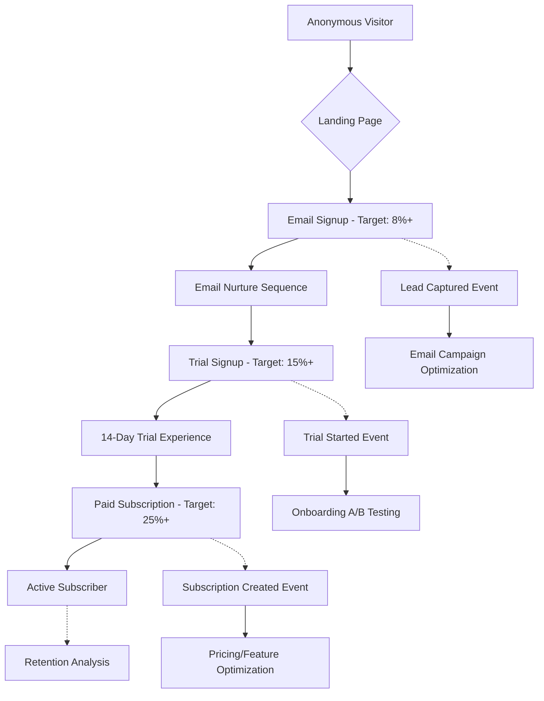

# Moon Ring Conversion Tracking & Analytics Architecture

**Version:** 1.0
**Date:** September 18, 2025
**Stack:** Next.js 14 + Supabase + Stripe + Analytics Layer
**Author:** Winston the Architect

---

## Executive Summary

This document defines the comprehensive conversion tracking and optimization architecture for Moon Ring, designed to achieve and monitor the PRD's aggressive conversion targets: 8%+ homepage to email signup, 15%+ email to trial, and 25%+ trial to paid subscription. The architecture supports real-time A/B testing, funnel analysis, and data-driven optimization across the entire user journey.

---

## Conversion Funnel Architecture

### Primary Conversion Funnel



### Detailed Event Tracking Schema

#### 1. Anonymous Visitor Events
```typescript
interface VisitorEvent {
  event_id: string
  session_id: string
  user_agent: string
  ip_address: string
  landing_page: string
  referrer: string
  utm_source?: string
  utm_medium?: string
  utm_campaign?: string
  utm_content?: string
  timestamp: Date
  page_events: PageEvent[]
}

interface PageEvent {
  page_url: string
  time_on_page: number
  scroll_depth: number
  clicks: ClickEvent[]
  form_interactions: FormEvent[]
}
```

#### 2. Lead Conversion Events
```typescript
interface LeadConversionEvent {
  event_id: string
  session_id: string
  lead_id: string
  conversion_type: 'email_signup' | 'assessment_start' | 'demo_request' | 'corporate_inquiry'
  conversion_source: string // Which CTA, form, or page
  form_data: Record<string, any>
  a_b_test_variant?: string
  timestamp: Date
  user_attributes: {
    wearable_devices?: string[]
    health_goals?: string[]
    pain_points?: string[]
  }
}
```

#### 3. Trial Conversion Events
```typescript
interface TrialConversionEvent {
  event_id: string
  user_id: string
  lead_id?: string
  trial_signup_source: string
  onboarding_completion_rate: number
  initial_goals_created: number
  social_features_engaged: boolean
  trial_engagement_score: number
  timestamp: Date
}
```

#### 4. Subscription Events
```typescript
interface SubscriptionEvent {
  event_id: string
  user_id: string
  stripe_subscription_id: string
  conversion_source: 'trial_end' | 'early_conversion' | 'email_campaign'
  plan_selected: string
  trial_days_used: number
  engagement_metrics: {
    goals_completed: number
    social_interactions: number
    app_sessions: number
    feature_usage: Record<string, number>
  }
  timestamp: Date
}
```

---

## Analytics Stack Architecture

### Core Analytics Infrastructure

```typescript
// Analytics configuration
interface AnalyticsConfig {
  // Google Analytics 4 - Free, comprehensive tracking
  google_analytics: {
    measurement_id: string
    enhanced_ecommerce: boolean
    custom_events: string[]
  }

  // Mixpanel - Product analytics and funnel analysis
  mixpanel: {
    project_token: string
    track_all_clicks: boolean
    funnel_definitions: FunnelConfig[]
  }

  // Hotjar - User behavior and heatmaps
  hotjar: {
    site_id: number
    heatmap_pages: string[]
    recording_triggers: string[]
  }

  // PostHog - Open source product analytics (alternative)
  posthog?: {
    api_key: string
    feature_flags: boolean
    session_recordings: boolean
  }
}
```

### Event Tracking Implementation

#### Client-Side Tracking (Next.js)
```typescript
// lib/analytics/client.ts
class AnalyticsClient {
  private providers: AnalyticsProvider[] = []

  constructor() {
    // Initialize all analytics providers
    this.providers = [
      new GoogleAnalyticsProvider(),
      new MixpanelProvider(),
      new HotjarProvider(),
      new SupabaseAnalyticsProvider(), // Custom events to Supabase
    ]
  }

  // Core tracking methods
  track(event: string, properties: Record<string, any>) {
    this.providers.forEach(provider => {
      provider.track(event, properties)
    })
  }

  // Conversion-specific methods
  trackPageView(page: string, properties?: Record<string, any>) {
    this.track('page_view', { page, ...properties })
  }

  trackLeadCapture(leadData: LeadConversionEvent) {
    this.track('lead_captured', leadData)

    // Trigger email automation
    this.triggerEmailSequence(leadData.lead_id)
  }

  trackTrialSignup(trialData: TrialConversionEvent) {
    this.track('trial_started', trialData)

    // Set up trial conversion tracking
    this.scheduleTrialConversionReminders(trialData.user_id)
  }

  trackSubscriptionConversion(subscriptionData: SubscriptionEvent) {
    this.track('subscription_created', subscriptionData)

    // Calculate and update conversion rates
    this.updateConversionMetrics(subscriptionData)
  }
}
```

#### Server-Side Tracking (API Routes)
```typescript
// app/api/analytics/events/route.ts
export async function POST(request: Request) {
  const event = await request.json()

  // Store in Supabase for analysis
  await supabase.from('analytics_events').insert({
    event_name: event.name,
    properties: event.properties,
    user_id: event.user_id,
    session_id: event.session_id,
    timestamp: new Date().toISOString()
  })

  // Forward to external analytics
  await Promise.all([
    sendToMixpanel(event),
    sendToGoogleAnalytics(event),
    updateConversionFunnels(event)
  ])

  return NextResponse.json({ success: true })
}
```

---

## A/B Testing Architecture

### Test Configuration System

```typescript
interface ABTestConfig {
  test_id: string
  test_name: string
  status: 'draft' | 'running' | 'paused' | 'completed'
  traffic_allocation: number // Percentage of users to include
  variants: TestVariant[]
  success_metrics: string[]
  statistical_significance: number // e.g., 0.95 for 95% confidence
  minimum_sample_size: number
  start_date: Date
  end_date?: Date
}

interface TestVariant {
  variant_id: string
  name: string
  traffic_split: number // Percentage within test
  changes: {
    component_overrides: Record<string, any>
    copy_changes: Record<string, string>
    style_changes: Record<string, any>
  }
}
```

### Implementation with Next.js Edge Functions

```typescript
// app/api/ab-test/assign/route.ts
import { NextRequest } from 'next/server'

export const runtime = 'edge'

export async function GET(request: NextRequest) {
  const sessionId = request.cookies.get('session_id')?.value || generateSessionId()
  const userAgent = request.headers.get('user-agent') || ''

  // Get active tests
  const activeTests = await getActiveTests()

  // Assign user to test variants
  const assignments: Record<string, string> = {}

  for (const test of activeTests) {
    if (shouldIncludeInTest(sessionId, test.traffic_allocation)) {
      assignments[test.test_id] = assignVariant(sessionId, test.variants)
    }
  }

  // Store assignments in edge cache
  await storeTestAssignments(sessionId, assignments)

  return NextResponse.json({
    session_id: sessionId,
    test_assignments: assignments
  })
}
```

### Test Component Integration

```typescript
// components/ABTestWrapper.tsx
interface ABTestWrapperProps {
  testId: string
  variants: Record<string, React.ComponentType>
  children?: React.ReactNode
}

export function ABTestWrapper({ testId, variants, children }: ABTestWrapperProps) {
  const [assignment, setAssignment] = useState<string>()

  useEffect(() => {
    fetch('/api/ab-test/assign')
      .then(res => res.json())
      .then(data => {
        setAssignment(data.test_assignments[testId] || 'control')
      })
  }, [testId])

  if (!assignment) return null

  const VariantComponent = variants[assignment]
  return VariantComponent ? <VariantComponent /> : children
}

// Usage example
export function PricingPage() {
  return (
    <ABTestWrapper
      testId="pricing_page_layout"
      variants={{
        control: PricingPageOriginal,
        variant_a: PricingPageAlternative,
        variant_b: PricingPageMinimal
      }}
    >
      <PricingPageOriginal />
    </ABTestWrapper>
  )
}
```

---

## Conversion Rate Optimization Dashboard

### Real-time Metrics Database Schema

```sql
-- Conversion funnel metrics (stored in Supabase)
CREATE TABLE conversion_metrics (
  id UUID DEFAULT uuid_generate_v4() PRIMARY KEY,
  date DATE NOT NULL,
  hour INTEGER, -- For hourly granularity
  funnel_stage TEXT NOT NULL CHECK (funnel_stage IN ('visitor', 'email_signup', 'trial_signup', 'subscription')),
  source TEXT, -- organic, paid, referral, etc.
  count INTEGER NOT NULL,
  conversion_rate DECIMAL(5,4), -- e.g., 0.0832 for 8.32%
  created_at TIMESTAMP WITH TIME ZONE DEFAULT NOW()
);

-- A/B test results
CREATE TABLE ab_test_results (
  id UUID DEFAULT uuid_generate_v4() PRIMARY KEY,
  test_id TEXT NOT NULL,
  variant_id TEXT NOT NULL,
  metric_name TEXT NOT NULL,
  metric_value DECIMAL,
  sample_size INTEGER,
  confidence_interval_low DECIMAL,
  confidence_interval_high DECIMAL,
  statistical_significance DECIMAL,
  date DATE NOT NULL,
  created_at TIMESTAMP WITH TIME ZONE DEFAULT NOW()
);

-- User journey tracking
CREATE TABLE user_journey_events (
  id UUID DEFAULT uuid_generate_v4() PRIMARY KEY,
  session_id TEXT NOT NULL,
  user_id UUID REFERENCES auth.users(id),
  event_name TEXT NOT NULL,
  event_properties JSONB,
  page_url TEXT,
  referrer TEXT,
  utm_source TEXT,
  utm_medium TEXT,
  utm_campaign TEXT,
  timestamp TIMESTAMP WITH TIME ZONE DEFAULT NOW(),

  -- Index for fast queries
  INDEX idx_user_journey_session (session_id, timestamp),
  INDEX idx_user_journey_user (user_id, timestamp),
  INDEX idx_user_journey_event (event_name, timestamp)
);
```

### Dashboard API Endpoints

```typescript
// app/api/dashboard/conversion-rates/route.ts
export async function GET(request: NextRequest) {
  const { searchParams } = new URL(request.url)
  const timeRange = searchParams.get('range') || '7d'

  // Calculate conversion rates for each stage
  const metrics = await supabase
    .from('conversion_metrics')
    .select('*')
    .gte('date', getDateFromRange(timeRange))
    .order('date', { ascending: true })

  // Group by funnel stage and calculate rates
  const funnelData = calculateFunnelMetrics(metrics.data || [])

  return NextResponse.json({
    current_rates: {
      visitor_to_email: funnelData.visitor_to_email,
      email_to_trial: funnelData.email_to_trial,
      trial_to_paid: funnelData.trial_to_paid
    },
    historical_data: funnelData.daily_metrics,
    targets: {
      visitor_to_email: 0.08, // 8%
      email_to_trial: 0.15,   // 15%
      trial_to_paid: 0.25     // 25%
    }
  })
}
```

---

## Implementation Priorities

### Phase 1: Core Tracking (Week 1)
1. **Set up basic event tracking** with Google Analytics 4
2. **Implement conversion events** for email signup, trial signup, subscription
3. **Create Supabase analytics tables** for custom event storage
4. **Build analytics client wrapper** for consistent cross-platform tracking

### Phase 2: A/B Testing (Week 2)
1. **Implement edge-based test assignment** for minimal performance impact
2. **Create test variant system** for homepage, pricing, and signup flows
3. **Build statistical significance calculator** for test validation
4. **Set up automated test reporting** and alerts

### Phase 3: Advanced Analytics (Week 3-4)
1. **Integrate Mixpanel** for advanced funnel analysis
2. **Add Hotjar** for user behavior insights
3. **Build conversion rate dashboard** with real-time metrics
4. **Implement cohort analysis** for retention tracking

### Phase 4: Optimization Automation (Week 5-6)
1. **Create automated email sequences** triggered by conversion events
2. **Build dynamic pricing tests** based on user segments
3. **Implement predictive lead scoring** using conversion data
4. **Set up automated alerts** for conversion rate changes

---

## Success Metrics & Monitoring

### Key Performance Indicators (KPIs)

| Metric | Current Baseline | Target | Measurement Frequency |
|--------|------------------|--------|---------------------|
| **Homepage → Email Signup** | TBD | 8%+ | Daily |
| **Email → Trial Signup** | TBD | 15%+ | Daily |
| **Trial → Paid Subscription** | TBD | 25%+ | Daily |
| **Customer Acquisition Cost** | TBD | <$150 | Weekly |
| **Lifetime Value** | TBD | $800+ | Monthly |
| **Trial Engagement Score** | TBD | 70%+ | Daily |

### Automated Alerts

```typescript
// Conversion rate monitoring
interface ConversionAlert {
  metric: string
  current_rate: number
  target_rate: number
  threshold_deviation: number // e.g., 0.2 for 20% below target
  alert_channels: ('email' | 'slack' | 'dashboard')[]
}

// Example alert configuration
const conversionAlerts: ConversionAlert[] = [
  {
    metric: 'homepage_to_email',
    current_rate: 0.0, // Will be updated in real-time
    target_rate: 0.08,
    threshold_deviation: 0.2, // Alert if 20% below target
    alert_channels: ['email', 'slack']
  },
  {
    metric: 'trial_to_paid',
    current_rate: 0.0,
    target_rate: 0.25,
    threshold_deviation: 0.15, // More sensitive for paid conversions
    alert_channels: ['email', 'slack', 'dashboard']
  }
]
```

---

## Integration with Existing Architecture

This conversion tracking architecture integrates seamlessly with our Next.js + Supabase + Stripe stack:

- **Next.js App Router**: Client and server-side tracking
- **Supabase**: Custom analytics storage and real-time dashboards
- **Stripe**: Automatic subscription conversion tracking via webhooks
- **Vercel Edge Functions**: Ultra-fast A/B test assignment
- **Moon Ring Design System**: Consistent tracking across all brand touchpoints

The system is designed for immediate implementation and continuous optimization, ensuring Moon Ring can achieve its ambitious conversion targets while maintaining the premium user experience that differentiates the platform.