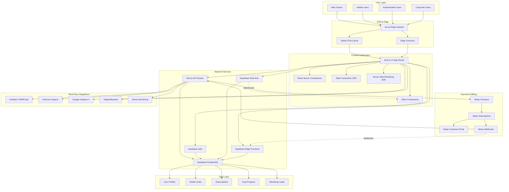
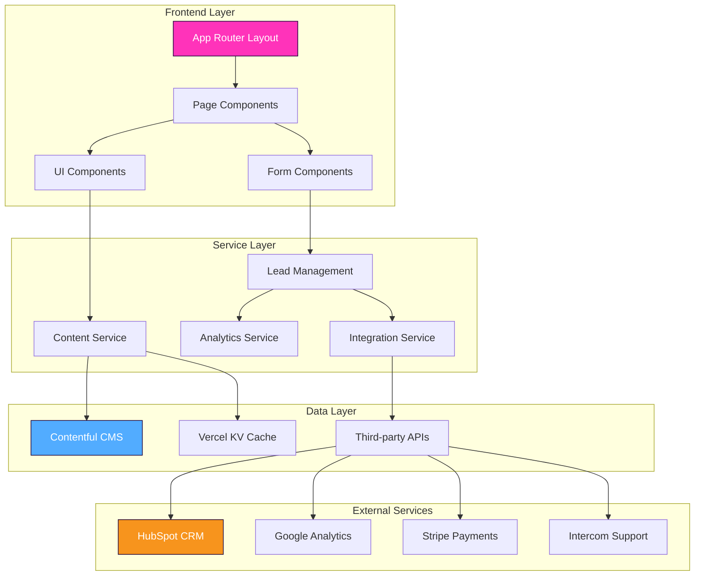
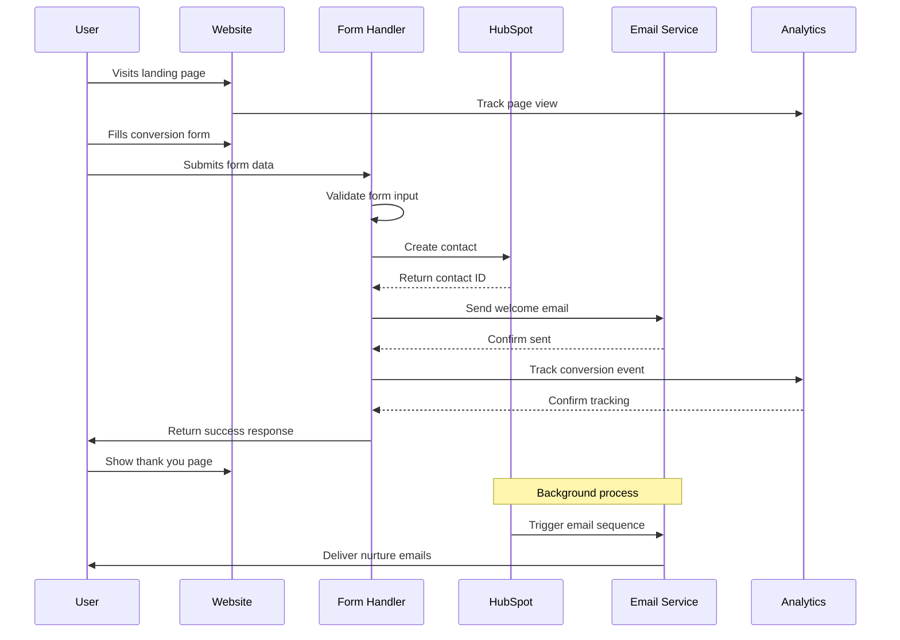
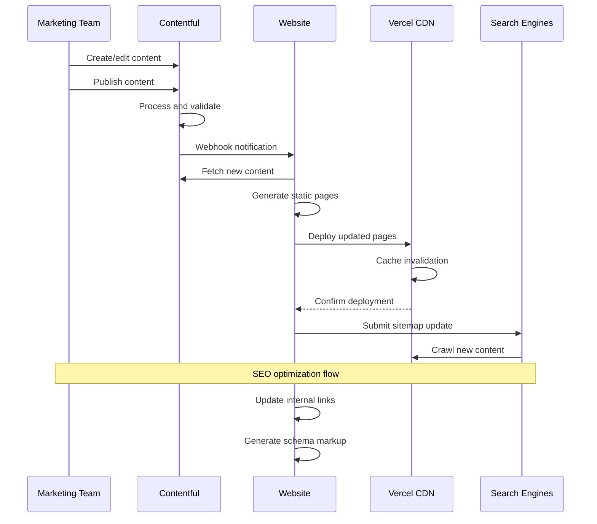
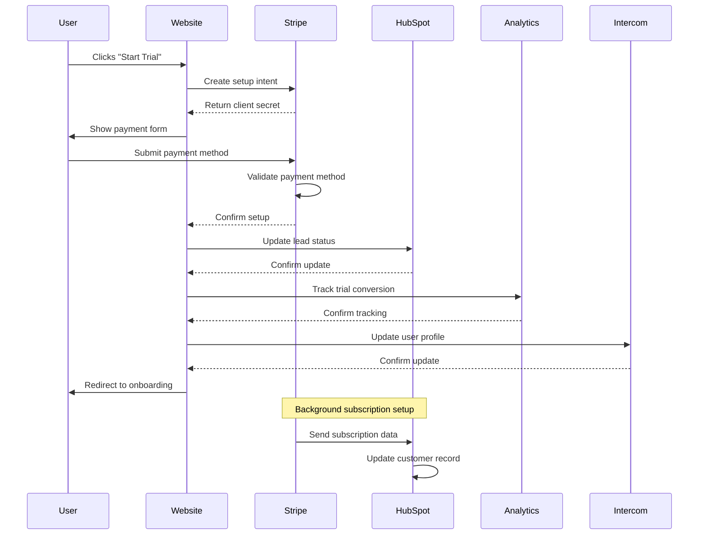
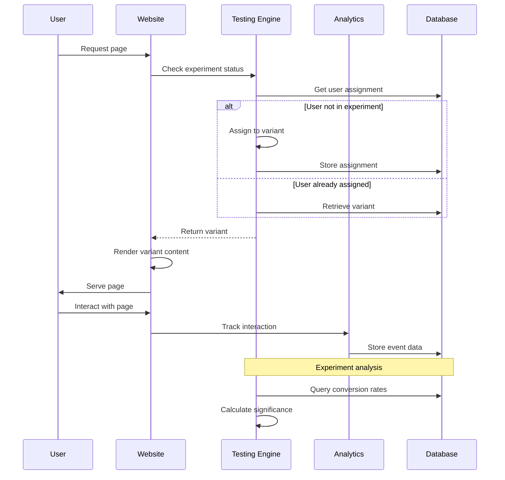
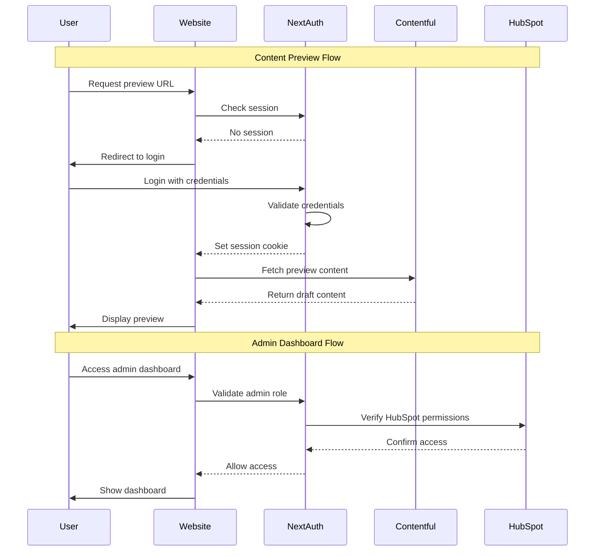
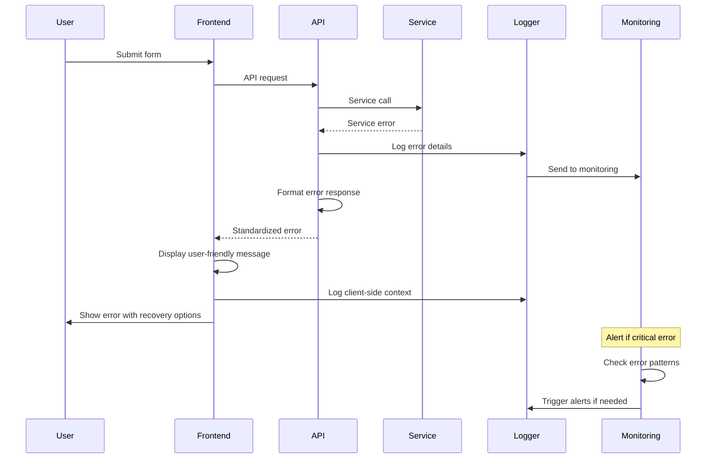

# Moon Ring Marketing Website Fullstack Architecture Document

**Version:** 1.0
**Date:** September 18, 2025
**Project:** Moon Ring Marketing Website Development
**Document Owner:** Winston the Architect

---

## Introduction

This document outlines the complete fullstack architecture for the Moon Ring Marketing Website, including backend systems, frontend implementation, and their integration. It serves as the single source of truth for AI-driven development, ensuring consistency across the entire technology stack.

This unified approach combines what would traditionally be separate backend and frontend architecture documents, streamlining the development process for modern fullstack applications where these concerns are increasingly intertwined.

### Starter Template or Existing Project

**Status**: Greenfield project with existing Next.js foundation

Based on the current project structure analysis, this is primarily a greenfield marketing website build with some existing Next.js foundation in place. The project will leverage:

- **Existing Foundation**: Basic Next.js structure with build artifacts present
- **Design System**: Established Moon Ring brand identity with deep purple gradients, glass-morphism effects, and health category color coding
- **Integration Requirements**: Must align with existing Moon Ring platform branding and eventual API integration

**Architectural Constraints**:
- Must maintain brand consistency with Moon Ring social accountability platform
- Required integration with multiple third-party services (HubSpot, Stripe, Intercom, analytics)
- Performance requirements: Core Web Vitals 90+, <2s load times
- SEO optimization for competitive wearable and behavioral health keywords

### Change Log

| Date | Version | Description | Author |
|------|---------|-------------|---------|
| 2025-09-18 | 1.0 | Initial architecture document | Winston the Architect |

---

## High Level Architecture

### Technical Summary

The Moon Ring platform employs a hybrid architecture using **Next.js 14 + Supabase + Stripe** for optimal performance, scalability, and future-proofing. This stack seamlessly scales from marketing website to full SaaS platform without architectural rewrites. The frontend utilizes Next.js 14's App Router for hybrid rendering (static for marketing, dynamic for user accounts), while Supabase provides managed PostgreSQL with real-time capabilities and built-in authentication. Stripe handles subscription billing with 14-day trials and customer portal integration. The architecture prioritizes conversion optimization through A/B testing, real-time user experiences, and progressive enhancement from marketing site to complete ecommerce platform supporting account management, subscription billing, and social accountability features.

### Platform and Infrastructure Choice

After evaluating platform options against the PRD requirements for SEO performance, marketing team autonomy, and integration needs:

**Evaluated Options:**
1. **Next.js 14 + Supabase + Stripe** ✅ (Selected)
   - **Pros**: Hybrid rendering, real-time capabilities, managed auth/database, proven payment infrastructure, scales from marketing to SaaS
   - **Cons**: Supabase vendor dependency, PostgreSQL limitations at extreme scale
   - **Best for**: Rapid development, ecommerce evolution, real-time features

2. **Traditional Server-Side (Node.js + PostgreSQL + Stripe)**
   - **Pros**: Full control, complex business logic support, established patterns
   - **Cons**: Higher hosting costs, DevOps complexity, slower development velocity
   - **Best for**: Complex enterprise requirements, custom payment flows

3. **Pure Jamstack (Next.js + Contentful + Serverless)**
   - **Pros**: Maximum performance, simple deployment, content team autonomy
   - **Cons**: Limited by API-only backend, difficult user account management
   - **Best for**: Content-heavy sites without user accounts

**Final Architecture Decision: Next.js 14 + Supabase + Stripe**

**Platform:** Vercel (Frontend) + Supabase Cloud (Backend) + Stripe (Payments)
**Key Services:** Next.js 14 App Router, Supabase PostgreSQL + Auth + Real-time, Stripe Subscriptions + Customer Portal
**Deployment Strategy:** Vercel edge deployment with Supabase global regions for optimal performance

### Repository Structure

**Structure:** Single Next.js 14 application with feature-based organization
**Package Manager:** npm with workspaces for potential future expansion
**Organization Strategy:** App Router structure with grouped routes for marketing vs authenticated areas

The application uses Next.js 14's App Router with route groups to separate marketing pages from authenticated user features, enabling progressive enhancement from marketing site to full platform without restructuring.

### High Level Architecture Diagram



### Architectural Patterns

- **Hybrid Rendering Architecture:** Next.js 14 App Router with static generation for marketing pages and server-side rendering for user accounts - _Rationale:_ Optimizes SEO performance while enabling dynamic user experiences and real-time features
- **Progressive Enhancement:** Scales from marketing website to full SaaS platform without architectural rewrites - _Rationale:_ Enables rapid market validation while preserving ability to add ecommerce features
- **Real-time Data Layer:** Supabase PostgreSQL with WebSocket subscriptions for live user interactions - _Rationale:_ Supports social accountability features and live goal tracking without complex infrastructure
- **Secure by Default:** Row Level Security (RLS) policies and built-in authentication - _Rationale:_ Protects user data while simplifying security implementation
- **Component-Based UI:** Reusable React components with TypeScript and Moon Ring design system - _Rationale:_ Ensures brand consistency across marketing and application areas
- **Headless CMS Pattern:** Contentful for content management with Next.js frontend - _Rationale:_ Enables marketing team autonomy for content updates while maintaining developer control over conversion-critical pages
- **Server-First Rendering:** Next.js App Router with Server Components - _Rationale:_ Optimal SEO performance for organic traffic acquisition targeting 40% of total traffic
- **Edge-First Deployment:** Vercel Edge Functions for global performance - _Rationale:_ International expansion readiness with consistent sub-2s load times worldwide
- **Progressive Enhancement:** Core functionality without JavaScript, enhanced with React - _Rationale:_ Ensures accessibility compliance and performance on all devices while providing rich interactions
- **API Gateway Pattern:** Centralized serverless functions for all third-party integrations - _Rationale:_ Simplified integration management and centralized error handling for critical conversion flows

---

## Tech Stack

This is the DEFINITIVE technology selection for the entire project. All development must use these exact versions.

### Technology Stack Table

| Category | Technology | Version | Purpose | Rationale |
|----------|------------|---------|---------|-----------|
| Frontend Language | TypeScript | 5.2+ | Type-safe development | Prevents runtime errors in conversion-critical code paths |
| Frontend Framework | Next.js | 14.0+ | React framework with App Router | Hybrid rendering: static for marketing, SSR for user accounts |
| UI Component Library | Tailwind CSS + shadcn/ui | 3.3+ / Latest | Styling and accessible components | Moon Ring design system with glass-morphism effects |
| State Management | React Server Components + Zustand | Latest / 4.4+ | Server-first with client state | Real-time goal tracking and minimal client state |
| Backend Language | TypeScript | 5.2+ | Consistent language across stack | Shared types between frontend, API routes, and database |
| Database | Supabase PostgreSQL | Latest | Managed PostgreSQL with real-time | User accounts, subscriptions, health goals with RLS security |
| Authentication | Supabase Auth | Latest | Built-in auth with social providers | User signup, login, password reset, magic links, MFA |
| Real-time Features | Supabase Real-time | Latest | WebSocket subscriptions | Live goal updates, progress tracking, social features |
| Backend Functions | Supabase Edge Functions + Next.js API Routes | Latest | Serverless compute | Payment webhooks, lead processing, analytics |
| Payment Processing | Stripe | Latest | Subscription billing and payments | 14-day trials, subscription management, customer portal |
| Email & CRM | HubSpot | Latest | Marketing automation and CRM | Lead nurturing, email campaigns, sales pipeline |
| Cache | Supabase cache + Next.js cache | Built-in | Multi-layer caching | Fast data access and optimal Core Web Vitals |
| File Storage | Supabase Storage | Latest | User-generated content and assets | Profile images, goal media, document uploads |
| Frontend Testing | Vitest + Testing Library | Latest | Unit and integration testing | Component testing and user interaction validation |
| Backend Testing | Supabase Local + Vitest | Latest | Database and API testing | Schema testing, RLS policy validation |
| E2E Testing | Playwright | 1.40+ | End-to-end user flows | Signup, payment, goal creation, subscription flows |
| Build Tool | Next.js built-in | 14.0+ | Integrated build system | App Router optimizations and static generation |
| Deployment | Vercel | Latest | Frontend and edge functions | Global CDN with edge compute capabilities |
| Monitoring | Vercel Analytics + Sentry + Supabase Dashboard | Latest | Full-stack monitoring | Performance, errors, database metrics, user analytics |
| CSS Framework | Tailwind CSS | 3.3+ | Utility-first styling | Moon Ring brand colors, gradients, glass-morphism |

---

## Data Models

Based on the PRD requirements and chosen Supabase + Stripe stack, the data models support the complete journey from marketing lead capture to subscription management and health goal tracking. The schema uses PostgreSQL with Row Level Security for multi-tenant data isolation.

### User Profile (extends Supabase auth.users)

**Purpose:** Central user account management extending Supabase's built-in authentication with Moon Ring-specific profile data and subscription status.

**Key Attributes:**
- id: UUID - References auth.users.id (Primary Key)
- email: string - From auth.users
- full_name: string - Display name
- subscription_status: enum - Current subscription state
- stripe_customer_id: string - Links to Stripe customer
- trial_ends_at: timestamp - Trial period tracking

#### TypeScript Interface

```typescript
interface UserProfile {
  id: string; // UUID from auth.users
  email: string;
  full_name?: string;
  avatar_url?: string;
  subscription_status: 'inactive' | 'trialing' | 'active' | 'past_due' | 'canceled';
  stripe_customer_id?: string;
  trial_ends_at?: Date;
  created_at: Date;
  updated_at: Date;
}
```

### Health Goal

**Purpose:** Core feature for users to set, track, and achieve health and wellness goals with social accountability features.

**Key Attributes:**
- id: UUID - Unique identifier
- user_id: UUID - References profiles.id
- category: enum - Health focus area (movement, sleep, stress, recovery)
- title: string - Goal name
- target_value: number - Quantified goal target
- status: enum - Goal lifecycle state

#### TypeScript Interface

```typescript
interface HealthGoal {
  id: string;
  user_id: string;
  category: 'movement' | 'sleep' | 'stress' | 'recovery';
  title: string;
  description?: string;
  target_value?: number;
  target_unit?: string;
  status: 'active' | 'paused' | 'completed' | 'archived';
  created_at: Date;
  updated_at: Date;
}
```

### Subscription

**Purpose:** Manage user subscription lifecycle with Stripe integration for billing, trials, and plan management.

**Key Attributes:**
- id: UUID - Unique identifier
- user_id: UUID - References profiles.id
- stripe_subscription_id: string - Links to Stripe subscription
- status: enum - Subscription state matching Stripe statuses
- price_id: string - Stripe price identifier

#### TypeScript Interface

```typescript
interface Subscription {
  id: string;
  user_id: string;
  stripe_subscription_id: string;
  status: 'active' | 'canceled' | 'incomplete' | 'incomplete_expired' | 'past_due' | 'trialing' | 'unpaid';
  price_id: string;
  quantity: number;
  cancel_at_period_end: boolean;
  current_period_start: Date;
  current_period_end: Date;
  trial_start?: Date;
  trial_end?: Date;
  created_at: Date;
  updated_at: Date;
}
```

### Marketing Lead

**Purpose:** Capture and manage potential customers through various conversion funnels before they become authenticated users.

#### TypeScript Interface

```typescript
interface Lead {
  id: string;
  email: string;
  full_name?: string;
  source?: string; // 'homepage', 'pricing', 'blog', etc.
  utm_campaign?: string;
  utm_source?: string;
  utm_medium?: string;
  status: 'new' | 'contacted' | 'qualified' | 'converted';
  created_at: Date;
}
```

#### Database Relationships
- **User Profile** → **Health Goals** (One-to-Many)
- **User Profile** → **Subscriptions** (One-to-Many, typically One-to-One active)
- **Health Goal** → **Goal Progress** (One-to-Many)
- **Marketing Leads** → Independent (converts to User Profile on signup)

### Content

**Purpose:** Manage all marketing content including blog posts, case studies, resources, and landing page variants for A/B testing and SEO optimization.

**Key Attributes:**
- id: string - Unique identifier
- slug: string - SEO-friendly URL
- title: string - Page title and SEO
- contentType: enum - Blog, case study, resource, landing page
- category: enum - Health category alignment
- publishStatus: enum - Content lifecycle management
- publishDate: Date - SEO and freshness
- author: string - Attribution and expertise
- seoMetadata: object - Complete SEO optimization
- body: rich text - Main content
- leadMagnets: array - Conversion elements

#### TypeScript Interface

```typescript
interface Content {
  id: string;
  slug: string;
  title: string;
  excerpt: string;
  contentType: 'blog' | 'case_study' | 'resource' | 'landing_page' | 'guide';
  category: 'movement' | 'sleep' | 'stress' | 'recovery' | 'general';
  publishStatus: 'draft' | 'published' | 'archived';
  publishDate: Date;
  updatedAt: Date;
  author: string;
  seoMetadata: {
    metaTitle: string;
    metaDescription: string;
    keywords: string[];
    ogImage?: string;
  };
  body: string; // Rich text content
  leadMagnets: {
    type: 'download' | 'trial' | 'newsletter';
    title: string;
    description: string;
    ctaText: string;
    conversionGoal: string;
  }[];
  tags: string[];
  readingTime: number;
  viewCount: number;
  conversionRate?: number;
}
```

#### Relationships
- One-to-many with ContentViews
- Many-to-many with Tags
- One-to-many with ConversionEvents

### ConversionEvent

**Purpose:** Track all conversion events across the website for optimization analysis, A/B testing insights, and ROI measurement of different traffic sources and content pieces.

**Key Attributes:**
- id: string - Unique event identifier
- leadId: string - Attribution to lead
- eventType: enum - Conversion action type
- page: string - Page where conversion occurred
- variant: string - A/B testing variation
- source: string - Traffic attribution
- value: number - Economic value when applicable
- timestamp: Date - Precise timing data
- metadata: object - Additional context data

#### TypeScript Interface

```typescript
interface ConversionEvent {
  id: string;
  leadId: string;
  eventType: 'email_signup' | 'trial_signup' | 'demo_request' | 'download' | 'contact';
  page: string;
  variant?: string; // For A/B testing
  source: string;
  campaign?: string;
  value?: number; // Economic value
  timestamp: Date;
  userAgent: string;
  referrer?: string;
  metadata: {
    formId?: string;
    ctaPosition?: string;
    scrollDepth?: number;
    timeOnPage?: number;
    [key: string]: any;
  };
}
```

#### Relationships
- Many-to-one with Lead
- Many-to-one with Content (if applicable)
- One-to-many with AttributionData

---

## API Specification

The marketing website uses a hybrid approach combining Next.js Server Actions for form handling and traditional REST endpoints for third-party integrations and analytics.

### REST API Specification

```yaml
openapi: 3.0.0
info:
  title: Moon Ring Marketing Website API
  version: 1.0.0
  description: Marketing website backend API for lead generation, content management, and conversion tracking
servers:
  - url: https://moonring.com/api
    description: Production API
  - url: https://preview-moonring.vercel.app/api
    description: Preview environment

paths:
  /leads:
    post:
      summary: Create new lead
      tags: [Lead Management]
      requestBody:
        required: true
        content:
          application/json:
            schema:
              type: object
              required: [email, source]
              properties:
                email:
                  type: string
                  format: email
                firstName:
                  type: string
                lastName:
                  type: string
                company:
                  type: string
                source:
                  type: string
                  enum: [organic, paid, referral, direct]
                campaign:
                  type: string
                userType:
                  type: string
                  enum: [individual, corporate]
                interests:
                  type: array
                  items:
                    type: string
      responses:
        201:
          description: Lead created successfully
          content:
            application/json:
              schema:
                $ref: '#/components/schemas/Lead'
        400:
          description: Invalid input
        409:
          description: Email already exists

  /content:
    get:
      summary: Get published content
      tags: [Content]
      parameters:
        - name: type
          in: query
          schema:
            type: string
            enum: [blog, case_study, resource, landing_page]
        - name: category
          in: query
          schema:
            type: string
            enum: [movement, sleep, stress, recovery, general]
        - name: limit
          in: query
          schema:
            type: integer
            default: 10
      responses:
        200:
          description: Content list
          content:
            application/json:
              schema:
                type: object
                properties:
                  data:
                    type: array
                    items:
                      $ref: '#/components/schemas/Content'
                  pagination:
                    $ref: '#/components/schemas/Pagination'

  /analytics/conversion:
    post:
      summary: Track conversion event
      tags: [Analytics]
      requestBody:
        required: true
        content:
          application/json:
            schema:
              $ref: '#/components/schemas/ConversionEvent'
      responses:
        201:
          description: Event tracked
        400:
          description: Invalid event data

  /integrations/hubspot/webhook:
    post:
      summary: HubSpot webhook handler
      tags: [Integrations]
      security:
        - hubspotSignature: []
      requestBody:
        required: true
        content:
          application/json:
            schema:
              type: object
      responses:
        200:
          description: Webhook processed
        401:
          description: Invalid signature

components:
  schemas:
    Lead:
      type: object
      properties:
        id:
          type: string
        email:
          type: string
        firstName:
          type: string
        lastName:
          type: string
        source:
          type: string
        leadScore:
          type: number
        status:
          type: string
        createdAt:
          type: string
          format: date-time

    Content:
      type: object
      properties:
        id:
          type: string
        slug:
          type: string
        title:
          type: string
        contentType:
          type: string
        category:
          type: string
        publishDate:
          type: string
          format: date-time

    ConversionEvent:
      type: object
      required: [leadId, eventType, page]
      properties:
        leadId:
          type: string
        eventType:
          type: string
        page:
          type: string
        value:
          type: number
        timestamp:
          type: string
          format: date-time

    Pagination:
      type: object
      properties:
        page:
          type: integer
        limit:
          type: integer
        total:
          type: integer
        pages:
          type: integer

  securitySchemes:
    hubspotSignature:
      type: apiKey
      in: header
      name: X-HubSpot-Signature
```

---

## Components

Based on the architectural patterns and tech stack choices, the system consists of both frontend UI components and backend service components that work together to deliver the marketing website experience.

### Frontend UI Components

**Responsibility:** Render marketing pages with Moon Ring design system consistency, handle user interactions, and drive conversions through optimized UX patterns.

**Key Interfaces:**
- Component props following TypeScript contracts
- Design system theming API (colors, gradients, glass-morphism)
- Conversion tracking events
- Content rendering from CMS

**Dependencies:** React 18, Tailwind CSS, Moon Ring Design System, Contentful SDK

**Technology Stack:** Next.js App Router, React Server Components, TypeScript, Tailwind CSS with custom Moon Ring theme configuration

### Content Management Component

**Responsibility:** Fetch, cache, and deliver marketing content from Contentful CMS while maintaining SEO optimization and performance standards.

**Key Interfaces:**
- Contentful GraphQL API
- Next.js ISR (Incremental Static Regeneration)
- SEO metadata injection
- Content preview system for editors

**Dependencies:** Contentful SDK, Next.js caching system, React components

**Technology Stack:** Contentful GraphQL API, Next.js App Router, React Server Components for optimal performance

### Lead Generation Component

**Responsibility:** Handle form submissions, lead scoring, and integration with HubSpot CRM while maintaining conversion optimization and user experience.

**Key Interfaces:**
- Form validation and submission
- HubSpot CRM API
- Email service integration
- Analytics event tracking

**Dependencies:** HubSpot SDK, Email service, Analytics tracking, Form validation libraries

**Technology Stack:** Next.js Server Actions, HubSpot API, React Hook Form for client-side experience

### Analytics & Conversion Tracking Component

**Responsibility:** Track user behavior, conversion events, A/B testing results, and provide data for optimization decisions across the conversion funnel.

**Key Interfaces:**
- Google Analytics 4 API
- Hotjar tracking API
- Mixpanel events API
- Custom conversion event system
- A/B testing result collection

**Dependencies:** GA4 SDK, Hotjar SDK, Mixpanel SDK, Vercel Analytics, Custom event handlers

**Technology Stack:** Multiple analytics SDKs, Vercel Edge Functions for data processing, React hooks for client-side tracking

### Integration Services Component

**Responsibility:** Manage all third-party service integrations including payment processing, customer support, email marketing, and maintain data synchronization.

**Key Interfaces:**
- Stripe API for payment processing
- Intercom API for customer support
- HubSpot API for marketing automation
- Webhook handling for real-time updates

**Dependencies:** Third-party service SDKs, Webhook security validation, Error handling and retry logic

**Technology Stack:** Vercel Serverless Functions, Third-party service SDKs, Webhook security middleware

### Component Diagrams



---

## External APIs

The Moon Ring marketing website requires integration with several external services to support lead generation, marketing automation, analytics, and customer support functions.

### HubSpot CRM & Marketing API

- **Purpose:** Lead management, email marketing automation, and sales funnel tracking
- **Documentation:** https://developers.hubspot.com/docs/api/overview
- **Base URL(s):** https://api.hubapi.com/
- **Authentication:** OAuth 2.0 with private app access tokens
- **Rate Limits:** 100 requests per 10 seconds for most endpoints

**Key Endpoints Used:**
- `POST /crm/v3/objects/contacts` - Create new leads
- `GET /crm/v3/objects/contacts` - Retrieve lead information
- `POST /marketing/v3/forms/submit` - Form submission tracking
- `POST /webhooks/v3/subscriptions` - Webhook management

**Integration Notes:** Critical for lead nurturing and conversion tracking. Requires webhook setup for real-time lead scoring updates. Form submissions must include lead source attribution for ROI analysis.

### Stripe Payments API

- **Purpose:** Trial signup payment processing and subscription management for direct conversions
- **Documentation:** https://stripe.com/docs/api
- **Base URL(s):** https://api.stripe.com/v1/
- **Authentication:** Bearer token with publishable/secret key pairs
- **Rate Limits:** 100 requests per second in live mode

**Key Endpoints Used:**
- `POST /v1/customers` - Create customer records
- `POST /v1/setup_intents` - Payment method setup
- `POST /v1/subscriptions` - Trial to paid conversion
- `GET /v1/invoices` - Revenue analytics

**Integration Notes:** Essential for trial to paid conversion optimization. Must handle both individual and corporate pricing tiers. Requires secure webhook handling for subscription status updates.

### Contentful Content Delivery API

- **Purpose:** Headless CMS for marketing content, blog posts, case studies, and landing page variants
- **Documentation:** https://www.contentful.com/developers/docs/references/content-delivery-api/
- **Base URL(s):** https://cdn.contentful.com/spaces/{SPACE_ID}/
- **Authentication:** Access token based
- **Rate Limits:** 55 requests per second

**Key Endpoints Used:**
- `GET /entries` - Fetch published content with filtering
- `GET /entries/{entry_id}` - Individual content pieces
- `GET /assets` - Media and document assets
- `GET /content_types` - Content structure information

**Integration Notes:** Critical for marketing team autonomy. Must implement proper caching strategy for performance. Preview API integration required for content review workflow.

### Google Analytics 4 Measurement Protocol

- **Purpose:** Server-side event tracking for conversion attribution and advanced analytics
- **Documentation:** https://developers.google.com/analytics/devguides/collection/protocol/ga4
- **Base URL(s):** https://www.google-analytics.com/mp/collect
- **Authentication:** Measurement ID and API secret
- **Rate Limits:** 500 events per request, 25 requests per second

**Key Endpoints Used:**
- `POST /mp/collect` - Send conversion events
- `POST /mp/debug/collect` - Validate events in development

**Integration Notes:** Essential for attribution analysis and conversion optimization. Must track custom events for lead generation funnel analysis. Requires GDPR compliance considerations.

### Intercom Messenger API

- **Purpose:** Customer support chat widget and lead qualification through conversational marketing
- **Documentation:** https://developers.intercom.com/intercom-api-reference
- **Base URL(s):** https://api.intercom.io/
- **Authentication:** Bearer token authentication
- **Rate Limits:** Varies by endpoint, typically 1000 requests per minute

**Key Endpoints Used:**
- `POST /contacts` - Create visitor profiles
- `POST /events` - Track user behavior
- `GET /conversations` - Support ticket management
- `POST /messages` - Automated messaging

**Integration Notes:** Important for conversion support and lead qualification. Must integrate with HubSpot for unified lead management. Requires proper visitor identification for personalized support.

---

## Core Workflows

The following sequence diagrams illustrate critical user journeys and system interactions that drive the primary business goals of lead generation and conversion optimization.

### Lead Generation Workflow



### Content Publishing Workflow



### Trial Conversion Workflow



### A/B Testing Workflow



---

## Database Schema

The marketing website uses a hybrid approach with Contentful as the primary CMS database and Vercel KV for caching and session data. The schema design focuses on content delivery optimization and lead management.

### Contentful Content Model

```typescript
// Content Type: Blog Post
interface BlogPostEntry {
  contentTypeId: 'blogPost';
  fields: {
    title: string;
    slug: string;
    excerpt: string;
    body: RichText;
    author: Link<AuthorEntry>;
    category: 'movement' | 'sleep' | 'stress' | 'recovery' | 'general';
    featuredImage: Asset;
    seoTitle: string;
    seoDescription: string;
    publishDate: Date;
    tags: string[];
    readingTime: number;
    leadMagnets: LeadMagnet[];
  };
  metadata: {
    tags: ContentfulTag[];
  };
}

// Content Type: Landing Page
interface LandingPageEntry {
  contentTypeId: 'landingPage';
  fields: {
    title: string;
    slug: string;
    heroSection: {
      headline: string;
      subheadline: string;
      ctaText: string;
      ctaLink: string;
      backgroundVariant: 'gradient' | 'solid';
    };
    features: FeatureCard[];
    testimonials: TestimonialCard[];
    pricing: PricingSection;
    seoMetadata: SEOMetadata;
  };
}

// Content Type: Success Story
interface SuccessStoryEntry {
  contentTypeId: 'successStory';
  fields: {
    title: string;
    customerName: string;
    customerTitle?: string;
    company?: string;
    avatar?: Asset;
    quote: string;
    fullStory: RichText;
    metrics: {
      beforeValue: string;
      afterValue: string;
      improvement: string;
      timeframe: string;
    };
    category: 'movement' | 'sleep' | 'stress' | 'recovery';
    featured: boolean;
    videoTestimonial?: Asset;
  };
}
```

### Vercel KV Cache Schema

```typescript
// Lead scoring and temporary data
interface CachedLead {
  leadId: string;
  email: string;
  score: number;
  interactions: InteractionEvent[];
  lastCalculated: Date;
  expiresAt: Date;
}

// A/B testing assignments
interface ExperimentAssignment {
  userId: string; // Anonymous ID or session ID
  experiments: {
    [experimentId: string]: {
      variant: string;
      assignedAt: Date;
      interactions: number;
      converted: boolean;
    };
  };
}

// Session-based analytics
interface SessionData {
  sessionId: string;
  userId?: string;
  source: string;
  campaign?: string;
  pages: string[];
  events: AnalyticsEvent[];
  startTime: Date;
  lastActivity: Date;
}

// Content performance cache
interface ContentMetrics {
  contentId: string;
  views: number;
  conversions: number;
  conversionRate: number;
  avgTimeOnPage: number;
  bounceRate: number;
  lastUpdated: Date;
}
```

### HubSpot CRM Schema (External)

```typescript
// HubSpot Contact Properties (mapped from our Lead model)
interface HubSpotContact {
  properties: {
    email: string;
    firstname?: string;
    lastname?: string;
    company?: string;
    phone?: string;
    website?: string;
    lead_source: string;
    lead_campaign?: string;
    lead_score: number;
    lifecycle_stage: 'subscriber' | 'lead' | 'marketing_qualified_lead' | 'sales_qualified_lead';
    user_type: 'individual' | 'corporate';
    wearable_devices?: string;
    interests?: string;
    notes_last_contacted?: Date;
    notes_last_activity?: Date;
    conversion_events?: number;
    trial_status?: string;
  };
  associations?: {
    companies?: number[];
    deals?: number[];
  };
}

// HubSpot Deal for Corporate Prospects
interface HubSpotDeal {
  properties: {
    dealname: string;
    dealstage: string;
    amount: number;
    closedate?: Date;
    pipeline: string;
    hubspot_owner_id: string;
    deal_type: 'Corporate Wellness' | 'Individual Trial';
    company_size?: string;
    budget?: number;
  };
}
```

### Analytics Data Models

```sql
-- Custom analytics tables (if using additional analytics database)
CREATE TABLE conversion_events (
    id VARCHAR(255) PRIMARY KEY,
    lead_id VARCHAR(255),
    event_type VARCHAR(50) NOT NULL,
    page VARCHAR(255) NOT NULL,
    variant VARCHAR(100),
    source VARCHAR(100),
    campaign VARCHAR(100),
    value DECIMAL(10,2),
    timestamp TIMESTAMP NOT NULL,
    user_agent TEXT,
    referrer VARCHAR(500),
    metadata JSON,
    INDEX idx_lead_id (lead_id),
    INDEX idx_event_type (event_type),
    INDEX idx_timestamp (timestamp),
    INDEX idx_source (source)
);

CREATE TABLE page_views (
    id VARCHAR(255) PRIMARY KEY,
    session_id VARCHAR(255),
    page VARCHAR(255) NOT NULL,
    timestamp TIMESTAMP NOT NULL,
    user_agent TEXT,
    referrer VARCHAR(500),
    time_on_page INT,
    scroll_depth INT,
    exit_page BOOLEAN DEFAULT FALSE,
    INDEX idx_session_id (session_id),
    INDEX idx_page (page),
    INDEX idx_timestamp (timestamp)
);

CREATE TABLE ab_test_results (
    experiment_id VARCHAR(100) NOT NULL,
    variant VARCHAR(100) NOT NULL,
    user_id VARCHAR(255) NOT NULL,
    converted BOOLEAN DEFAULT FALSE,
    conversion_value DECIMAL(10,2),
    assigned_at TIMESTAMP NOT NULL,
    converted_at TIMESTAMP NULL,
    PRIMARY KEY (experiment_id, user_id),
    INDEX idx_experiment_variant (experiment_id, variant),
    INDEX idx_converted (converted)
);
```

---

## Frontend Architecture

The frontend architecture leverages Next.js 14 App Router with React Server Components for optimal SEO performance while maintaining the Moon Ring design system consistency and conversion optimization focus.

### Component Architecture

#### Component Organization

```
apps/web/src/
├── app/                          # Next.js App Router
│   ├── globals.css              # Global styles with Moon Ring theme
│   ├── layout.tsx               # Root layout with brand consistency
│   ├── page.tsx                 # Homepage
│   ├── how-it-works/            # Platform explanation pages
│   ├── pricing/                 # Pricing and conversion pages
│   ├── success-stories/         # Social proof content
│   ├── blog/                    # SEO content hub
│   ├── corporate/               # B2B landing pages
│   └── api/                     # Server-side API routes
├── components/                   # Reusable UI components
│   ├── ui/                      # Base design system components
│   │   ├── Button.tsx           # Brand gradient CTAs
│   │   ├── Card.tsx             # Glass-morphism containers
│   │   ├── Input.tsx            # Form elements
│   │   └── Modal.tsx            # Overlays and dialogs
│   ├── marketing/               # Marketing-specific components
│   │   ├── Hero.tsx             # Landing page heroes
│   │   ├── FeatureSection.tsx   # Product feature displays
│   │   ├── Testimonial.tsx      # Social proof components
│   │   ├── PricingCard.tsx      # Subscription tiers
│   │   └── LeadForm.tsx         # Conversion forms
│   ├── content/                 # Content display components
│   │   ├── BlogPost.tsx         # Article layout
│   │   ├── CaseStudy.tsx        # Success story format
│   │   └── ResourceCard.tsx     # Download materials
│   └── layout/                  # Layout and navigation
│       ├── Header.tsx           # Site navigation
│       ├── Footer.tsx           # Site footer
│       └── Sidebar.tsx          # Content navigation
├── lib/                         # Utility functions
│   ├── contentful.ts           # CMS integration
│   ├── analytics.ts            # Tracking utilities
│   ├── validations.ts          # Form validation schemas
│   └── utils.ts                # General utilities
└── styles/                     # Styling system
    ├── globals.css             # Global styles and variables
    ├── components.css          # Component-specific styles
    └── themes.css              # Moon Ring design system
```

#### Component Template

```typescript
import { cn } from '@/lib/utils'
import { HTMLAttributes, forwardRef } from 'react'

interface CardProps extends HTMLAttributes<HTMLDivElement> {
  variant?: 'default' | 'glass' | 'solid'
  category?: 'movement' | 'sleep' | 'stress' | 'recovery'
  children: React.ReactNode
}

const Card = forwardRef<HTMLDivElement, CardProps>(
  ({ className, variant = 'glass', category, children, ...props }, ref) => {
    return (
      <div
        ref={ref}
        className={cn(
          // Base styles
          'rounded-xl p-6 transition-all duration-300',
          // Variant styles
          {
            'bg-white/8 backdrop-blur-lg border border-white/10': variant === 'glass',
            'bg-gradient-to-br from-moonring-pink to-moonring-orange': variant === 'default',
            'bg-white dark:bg-slate-900': variant === 'solid'
          },
          // Category accent colors
          {
            'border-l-4 border-movement-primary': category === 'movement',
            'border-l-4 border-sleep-primary': category === 'sleep',
            'border-l-4 border-stress-primary': category === 'stress',
            'border-l-4 border-recovery-primary': category === 'recovery'
          },
          className
        )}
        {...props}
      >
        {children}
      </div>
    )
  }
)
Card.displayName = 'Card'

export { Card, type CardProps }
```

### State Management Architecture

#### State Structure

```typescript
// Global state for marketing website (minimal client state)
interface AppState {
  // User session and preferences
  session: {
    leadId?: string;
    experiments: Record<string, string>; // A/B test assignments
    preferences: {
      theme: 'light' | 'dark';
      cookieConsent: boolean;
    };
  };

  // UI state for interactive elements
  ui: {
    mobileMenuOpen: boolean;
    modalStack: Array<{
      id: string;
      component: string;
      props: Record<string, any>;
    }>;
    loading: {
      forms: Record<string, boolean>;
      pages: Record<string, boolean>;
    };
  };

  // Analytics and tracking
  analytics: {
    sessionId: string;
    pageViews: number;
    events: AnalyticsEvent[];
    lastActivity: Date;
  };

  // Lead generation state
  lead: {
    formData: Partial<LeadFormData>;
    touchpoints: TouchpointEvent[];
    score: number;
    status: 'anonymous' | 'identified' | 'qualified';
  };
}

// Action types for state updates
type AppAction =
  | { type: 'SET_LEAD_ID'; payload: string }
  | { type: 'UPDATE_FORM_DATA'; payload: Partial<LeadFormData> }
  | { type: 'TRACK_EVENT'; payload: AnalyticsEvent }
  | { type: 'SET_EXPERIMENT'; payload: { experiment: string; variant: string } }
  | { type: 'TOGGLE_MOBILE_MENU' }
  | { type: 'SET_LOADING'; payload: { key: string; loading: boolean } };
```

#### State Management Patterns

- **Server Components First:** Minimize client-side state by leveraging React Server Components for data fetching
- **URL State for Navigation:** Use Next.js router and search params for navigation state
- **Form State with React Hook Form:** Optimized form handling with validation
- **Zustand for Client State:** Lightweight state management for UI interactions and session data
- **SWR for Client Data Fetching:** When client-side data fetching is necessary
- **Local Storage for Persistence:** User preferences and anonymous tracking

### Routing Architecture

#### Route Organization

```
app/                              # App Router structure
├── layout.tsx                    # Root layout with analytics
├── page.tsx                      # Homepage (/)
├── how-it-works/
│   ├── page.tsx                 # Platform overview (/how-it-works)
│   └── demo/
│       └── page.tsx             # Interactive demo (/how-it-works/demo)
├── pricing/
│   ├── page.tsx                 # Pricing tiers (/pricing)
│   ├── individual/
│   │   └── page.tsx             # Individual plans (/pricing/individual)
│   └── corporate/
│       └── page.tsx             # Corporate plans (/pricing/corporate)
├── success-stories/
│   ├── page.tsx                 # Success stories list (/success-stories)
│   └── [slug]/
│       └── page.tsx             # Individual stories (/success-stories/[slug])
├── blog/
│   ├── page.tsx                 # Blog index (/blog)
│   ├── [slug]/
│   │   └── page.tsx             # Blog posts (/blog/[slug])
│   └── category/
│       └── [category]/
│           └── page.tsx         # Category pages (/blog/category/[category])
├── corporate/
│   ├── page.tsx                 # Corporate landing (/corporate)
│   ├── demo/
│   │   └── page.tsx             # Corporate demo (/corporate/demo)
│   └── case-studies/
│       └── page.tsx             # B2B case studies (/corporate/case-studies)
├── resources/
│   ├── page.tsx                 # Resources hub (/resources)
│   ├── guides/
│   │   └── page.tsx             # Educational guides (/resources/guides)
│   └── downloads/
│       └── page.tsx             # Lead magnets (/resources/downloads)
├── support/
│   ├── page.tsx                 # Support center (/support)
│   └── faq/
│       └── page.tsx             # FAQ page (/support/faq)
└── api/                         # Server-side API routes
    ├── leads/
    │   └── route.ts             # Lead creation (/api/leads)
    ├── analytics/
    │   └── route.ts             # Event tracking (/api/analytics)
    └── webhooks/
        └── hubspot/
            └── route.ts         # HubSpot webhooks (/api/webhooks/hubspot)
```

#### Protected Route Pattern

```typescript
// middleware.ts - Route protection and analytics
import { NextRequest, NextResponse } from 'next/server'
import { trackPageView } from '@/lib/analytics'

export function middleware(request: NextRequest) {
  const response = NextResponse.next()

  // Add analytics tracking headers
  response.headers.set('x-pathname', request.nextUrl.pathname)
  response.headers.set('x-timestamp', Date.now().toString())

  // Handle A/B testing assignment
  const experiments = getActiveExperiments()
  for (const experiment of experiments) {
    if (!request.cookies.get(`exp_${experiment.id}`)) {
      const variant = assignToVariant(experiment)
      response.cookies.set(`exp_${experiment.id}`, variant, {
        maxAge: 60 * 60 * 24 * 30 // 30 days
      })
    }
  }

  // Admin routes protection
  if (request.nextUrl.pathname.startsWith('/admin')) {
    const token = request.cookies.get('admin_token')
    if (!token || !validateAdminToken(token.value)) {
      return NextResponse.redirect(new URL('/admin/login', request.url))
    }
  }

  // Content preview protection
  if (request.nextUrl.searchParams.has('preview')) {
    const previewToken = request.nextUrl.searchParams.get('preview')
    if (!validatePreviewToken(previewToken)) {
      return new NextResponse('Invalid preview token', { status: 401 })
    }
  }

  return response
}

export const config = {
  matcher: [
    '/((?!api/webhooks|_next/static|_next/image|favicon.ico).*)',
  ],
}
```

### Frontend Services Layer

#### API Client Setup

```typescript
// lib/api-client.ts
import { Lead, ConversionEvent, ContentFilters } from '@/types'

class APIClient {
  private baseURL: string

  constructor() {
    this.baseURL = process.env.NEXT_PUBLIC_API_URL || '/api'
  }

  // Lead management
  async createLead(leadData: Partial<Lead>): Promise<Lead> {
    const response = await fetch(`${this.baseURL}/leads`, {
      method: 'POST',
      headers: {
        'Content-Type': 'application/json',
      },
      body: JSON.stringify(leadData),
    })

    if (!response.ok) {
      throw new Error(`Failed to create lead: ${response.statusText}`)
    }

    return response.json()
  }

  // Analytics event tracking
  async trackConversion(event: ConversionEvent): Promise<void> {
    // Fire and forget for performance
    fetch(`${this.baseURL}/analytics/conversion`, {
      method: 'POST',
      headers: {
        'Content-Type': 'application/json',
      },
      body: JSON.stringify(event),
      keepalive: true,
    }).catch(error => {
      console.error('Failed to track conversion:', error)
    })
  }

  // Content fetching (with caching)
  async getContent(filters: ContentFilters): Promise<ContentResponse> {
    const params = new URLSearchParams(filters as any)
    const response = await fetch(`${this.baseURL}/content?${params}`, {
      next: { revalidate: 300 } // 5 minute cache
    })

    if (!response.ok) {
      throw new Error(`Failed to fetch content: ${response.statusText}`)
    }

    return response.json()
  }
}

export const apiClient = new APIClient()
```

#### Service Example

```typescript
// lib/services/lead-service.ts
import { apiClient } from '@/lib/api-client'
import { useAnalytics } from '@/hooks/use-analytics'
import { Lead, LeadFormData } from '@/types'

export class LeadService {
  constructor(private analytics: ReturnType<typeof useAnalytics>) {}

  async createLeadFromForm(
    formData: LeadFormData,
    source: string,
    variant?: string
  ): Promise<Lead> {
    try {
      // Create lead
      const lead = await apiClient.createLead({
        ...formData,
        source,
        leadScore: this.calculateInitialScore(formData),
        createdAt: new Date(),
        metadata: {
          variant,
          userAgent: navigator.userAgent,
          referrer: document.referrer,
        }
      })

      // Track conversion event
      await this.analytics.trackConversion({
        leadId: lead.id,
        eventType: 'email_signup',
        page: window.location.pathname,
        variant,
        source,
        timestamp: new Date(),
      })

      // Trigger HubSpot automation
      await this.triggerWelcomeSequence(lead)

      return lead

    } catch (error) {
      console.error('Lead creation failed:', error)
      throw new Error('Failed to create lead. Please try again.')
    }
  }

  private calculateInitialScore(formData: LeadFormData): number {
    let score = 20 // Base score

    if (formData.company) score += 30 // Corporate interest
    if (formData.phone) score += 15 // Contact willingness
    if (formData.interests?.length > 0) score += 10 // Specific needs
    if (formData.wearableDevices?.length > 0) score += 25 // Device ownership

    return Math.min(score, 100)
  }

  private async triggerWelcomeSequence(lead: Lead): Promise<void> {
    // This would typically be handled by HubSpot workflows
    // but we might need custom logic for specific scenarios
    if (lead.userType === 'corporate') {
      await this.scheduleFollowUp(lead)
    }
  }

  private async scheduleFollowUp(lead: Lead): Promise<void> {
    // Integration with HubSpot task creation
    await fetch('/api/integrations/hubspot/tasks', {
      method: 'POST',
      headers: { 'Content-Type': 'application/json' },
      body: JSON.stringify({
        leadId: lead.id,
        taskType: 'follow_up',
        priority: 'high',
        dueDate: new Date(Date.now() + 24 * 60 * 60 * 1000) // 24 hours
      })
    })
  }
}
```

---

## Backend Architecture

The backend architecture uses Next.js 14 App Router with serverless functions for optimal performance, scalability, and integration with the marketing technology stack.

### Service Architecture

#### Serverless Architecture

The Moon Ring marketing website leverages Vercel's serverless infrastructure for optimal performance and cost efficiency.

##### Function Organization

```
apps/web/src/app/api/
├── leads/
│   ├── route.ts                 # Lead creation and management
│   └── [id]/
│       └── route.ts             # Individual lead operations
├── content/
│   ├── route.ts                 # Content listing with filters
│   └── preview/
│       └── route.ts             # Content preview for editors
├── analytics/
│   ├── conversion/
│   │   └── route.ts             # Conversion event tracking
│   └── page-views/
│       └── route.ts             # Page view analytics
├── integrations/
│   ├── hubspot/
│   │   ├── webhook/
│   │   │   └── route.ts         # HubSpot webhook handler
│   │   └── sync/
│   │       └── route.ts         # Manual sync triggers
│   ├── stripe/
│   │   ├── webhook/
│   │   │   └── route.ts         # Stripe webhook handler
│   │   └── payment-intent/
│   │       └── route.ts         # Payment processing
│   └── contentful/
│       └── webhook/
│           └── route.ts         # Content update hooks
├── forms/
│   ├── contact/
│   │   └── route.ts             # Contact form handler
│   ├── demo/
│   │   └── route.ts             # Demo request handler
│   └── newsletter/
│       └── route.ts             # Newsletter signup
└── health/
    └── route.ts                 # Health check endpoint
```

##### Function Template

```typescript
// app/api/leads/route.ts
import { NextRequest, NextResponse } from 'next/server'
import { z } from 'zod'
import { HubSpotService } from '@/lib/services/hubspot'
import { AnalyticsService } from '@/lib/services/analytics'
import { validateRequest, withErrorHandling } from '@/lib/middleware'

// Request validation schema
const CreateLeadSchema = z.object({
  email: z.string().email('Invalid email address'),
  firstName: z.string().min(1, 'First name required').optional(),
  lastName: z.string().min(1, 'Last name required').optional(),
  company: z.string().optional(),
  source: z.enum(['organic', 'paid', 'referral', 'direct']),
  campaign: z.string().optional(),
  userType: z.enum(['individual', 'corporate']),
  interests: z.array(z.string()).default([]),
  wearableDevices: z.array(z.string()).optional(),
})

type CreateLeadRequest = z.infer<typeof CreateLeadSchema>

export async function POST(request: NextRequest) {
  return withErrorHandling(async () => {
    // Validate request body
    const body = await request.json()
    const validatedData = CreateLeadSchema.parse(body)

    // Initialize services
    const hubspot = new HubSpotService()
    const analytics = new AnalyticsService()

    // Create lead in HubSpot
    const hubspotContact = await hubspot.createContact({
      email: validatedData.email,
      firstname: validatedData.firstName,
      lastname: validatedData.lastName,
      company: validatedData.company,
      lead_source: validatedData.source,
      lead_campaign: validatedData.campaign,
      user_type: validatedData.userType,
      interests: validatedData.interests.join(', '),
      wearable_devices: validatedData.wearableDevices?.join(', '),
      lifecycle_stage: 'subscriber',
      lead_score: calculateLeadScore(validatedData),
    })

    // Track analytics event
    await analytics.trackConversion({
      leadId: hubspotContact.id,
      eventType: 'email_signup',
      page: request.headers.get('referer') || 'unknown',
      source: validatedData.source,
      campaign: validatedData.campaign,
      timestamp: new Date(),
      metadata: {
        userAgent: request.headers.get('user-agent'),
        ip: getClientIP(request),
      }
    })

    // Format response
    const lead = {
      id: hubspotContact.id,
      email: validatedData.email,
      firstName: validatedData.firstName,
      lastName: validatedData.lastName,
      source: validatedData.source,
      status: 'new' as const,
      leadScore: calculateLeadScore(validatedData),
      createdAt: new Date(),
      hubspotId: hubspotContact.id,
    }

    return NextResponse.json(lead, { status: 201 })
  })
}

export async function GET(request: NextRequest) {
  return withErrorHandling(async () => {
    const { searchParams } = new URL(request.url)
    const page = parseInt(searchParams.get('page') || '1')
    const limit = parseInt(searchParams.get('limit') || '10')
    const source = searchParams.get('source')

    const hubspot = new HubSpotService()
    const leads = await hubspot.getContacts({
      page,
      limit,
      filters: source ? { lead_source: source } : undefined
    })

    return NextResponse.json(leads)
  })
}

// Utility functions
function calculateLeadScore(data: CreateLeadRequest): number {
  let score = 20 // Base score

  if (data.company) score += 30 // Corporate interest
  if (data.firstName && data.lastName) score += 10 // Complete name
  if (data.interests.length > 0) score += 10 // Specific interests
  if (data.wearableDevices?.length > 0) score += 20 // Device ownership
  if (data.userType === 'corporate') score += 10 // B2B priority

  return Math.min(score, 100)
}

function getClientIP(request: NextRequest): string {
  return request.headers.get('x-forwarded-for')?.split(',')[0] ||
         request.headers.get('x-real-ip') ||
         'unknown'
}
```

### Database Architecture

The marketing website uses a hybrid database approach with Contentful for content management and Vercel KV for session data and caching.

#### Schema Design

```typescript
// lib/services/content.ts - Contentful integration
import { createClient, Entry } from 'contentful'

interface ContentfulConfig {
  spaceId: string
  accessToken: string
  previewAccessToken: string
  environment: string
}

export class ContentService {
  private client
  private previewClient

  constructor(private config: ContentfulConfig) {
    this.client = createClient({
      space: config.spaceId,
      accessToken: config.accessToken,
      environment: config.environment,
    })

    this.previewClient = createClient({
      space: config.spaceId,
      accessToken: config.previewAccessToken,
      environment: config.environment,
      host: 'preview.contentful.com',
    })
  }

  async getBlogPosts(options: {
    limit?: number
    category?: string
    skip?: number
    preview?: boolean
  } = {}) {
    const client = options.preview ? this.previewClient : this.client

    const entries = await client.getEntries({
      content_type: 'blogPost',
      limit: options.limit || 10,
      skip: options.skip || 0,
      'fields.category': options.category,
      order: '-fields.publishDate',
      include: 2, // Include referenced entries
    })

    return {
      posts: entries.items.map(this.transformBlogPost),
      total: entries.total,
      pages: Math.ceil(entries.total / (options.limit || 10))
    }
  }

  async getBlogPost(slug: string, preview = false) {
    const client = preview ? this.previewClient : this.client

    const entries = await client.getEntries({
      content_type: 'blogPost',
      'fields.slug': slug,
      limit: 1,
      include: 2,
    })

    if (entries.items.length === 0) {
      return null
    }

    return this.transformBlogPost(entries.items[0])
  }

  private transformBlogPost(entry: Entry<any>) {
    return {
      id: entry.sys.id,
      title: entry.fields.title,
      slug: entry.fields.slug,
      excerpt: entry.fields.excerpt,
      body: entry.fields.body,
      category: entry.fields.category,
      author: entry.fields.author?.fields,
      featuredImage: entry.fields.featuredImage?.fields,
      seoTitle: entry.fields.seoTitle,
      seoDescription: entry.fields.seoDescription,
      publishDate: new Date(entry.fields.publishDate),
      tags: entry.fields.tags || [],
      readingTime: entry.fields.readingTime || 5,
      leadMagnets: entry.fields.leadMagnets || [],
    }
  }
}
```

#### Data Access Layer

```typescript
// lib/services/database.ts - KV store operations
import { kv } from '@vercel/kv'

export class CacheService {
  // Lead scoring cache
  async cacheLeadScore(leadId: string, score: number, interactions: any[]) {
    const data = {
      leadId,
      score,
      interactions,
      lastCalculated: new Date(),
      expiresAt: new Date(Date.now() + 24 * 60 * 60 * 1000) // 24 hours
    }

    await kv.set(`lead:${leadId}:score`, data, { ex: 86400 }) // 24 hour expiry
  }

  async getLeadScore(leadId: string) {
    return await kv.get(`lead:${leadId}:score`)
  }

  // A/B testing assignments
  async assignExperiment(userId: string, experimentId: string, variant: string) {
    const key = `experiment:${userId}`
    const existing = await kv.get(key) || { experiments: {} }

    existing.experiments[experimentId] = {
      variant,
      assignedAt: new Date(),
      interactions: 0,
      converted: false
    }

    await kv.set(key, existing, { ex: 2592000 }) // 30 days
    return variant
  }

  async getExperimentAssignment(userId: string, experimentId: string) {
    const assignments = await kv.get(`experiment:${userId}`)
    return assignments?.experiments?.[experimentId]
  }

  // Session analytics
  async trackSession(sessionId: string, data: any) {
    const key = `session:${sessionId}`
    await kv.set(key, data, { ex: 3600 }) // 1 hour expiry
  }

  // Content performance metrics
  async incrementPageView(contentId: string) {
    const key = `metrics:${contentId}`
    const current = await kv.get(key) || { views: 0, conversions: 0 }
    current.views += 1
    current.lastViewed = new Date()
    await kv.set(key, current)
  }

  async incrementConversion(contentId: string) {
    const key = `metrics:${contentId}`
    const current = await kv.get(key) || { views: 0, conversions: 0 }
    current.conversions += 1
    current.conversionRate = current.conversions / Math.max(current.views, 1)
    await kv.set(key, current)
  }
}

export const cacheService = new CacheService()
```

### Authentication and Authorization

The marketing website has minimal authentication needs, primarily for content preview and admin functions.

#### Auth Flow



#### Middleware/Guards

```typescript
// lib/auth/middleware.ts
import { getToken } from 'next-auth/jwt'
import { NextRequest, NextResponse } from 'next/server'

export async function authMiddleware(request: NextRequest) {
  const token = await getToken({
    req: request,
    secret: process.env.NEXTAUTH_SECRET
  })

  // Protected admin routes
  if (request.nextUrl.pathname.startsWith('/admin')) {
    if (!token) {
      return NextResponse.redirect(new URL('/auth/signin', request.url))
    }

    if (!token.roles?.includes('admin')) {
      return new NextResponse('Forbidden', { status: 403 })
    }
  }

  // Preview routes require authentication
  if (request.nextUrl.searchParams.has('preview')) {
    if (!token) {
      return NextResponse.redirect(
        new URL(`/auth/signin?callbackUrl=${request.url}`, request.url)
      )
    }
  }

  return NextResponse.next()
}

// pages/api/auth/[...nextauth].ts
import NextAuth from 'next-auth'
import CredentialsProvider from 'next-auth/providers/credentials'

export default NextAuth({
  providers: [
    CredentialsProvider({
      name: 'Admin Login',
      credentials: {
        email: { label: 'Email', type: 'email' },
        password: { label: 'Password', type: 'password' }
      },
      async authorize(credentials) {
        // Validate against admin users (environment variables or database)
        const adminUsers = process.env.ADMIN_USERS?.split(',') || []
        const adminPassword = process.env.ADMIN_PASSWORD

        if (
          credentials?.email &&
          adminUsers.includes(credentials.email) &&
          credentials.password === adminPassword
        ) {
          return {
            id: credentials.email,
            email: credentials.email,
            name: 'Admin',
            roles: ['admin']
          }
        }

        return null
      }
    })
  ],
  callbacks: {
    async jwt({ token, user }) {
      if (user) {
        token.roles = user.roles
      }
      return token
    },
    async session({ session, token }) {
      session.user.roles = token.roles
      return session
    }
  },
  pages: {
    signIn: '/auth/signin',
  },
  session: {
    strategy: 'jwt',
  },
})
```

---

## Unified Project Structure

The project uses a simplified monorepo structure optimized for marketing website development and future platform integration.

```plaintext
moonring-website/
├── .github/                     # CI/CD workflows
│   └── workflows/
│       ├── ci.yaml              # Test and build pipeline
│       ├── deploy-preview.yaml  # Preview deployments
│       └── deploy-production.yaml # Production deployment
│
├── apps/                        # Application packages
│   └── web/                     # Marketing website application
│       ├── src/
│       │   ├── app/             # Next.js App Router
│       │   │   ├── globals.css  # Moon Ring design system styles
│       │   │   ├── layout.tsx   # Root layout with analytics
│       │   │   ├── page.tsx     # Homepage
│       │   │   ├── how-it-works/ # Platform explanation
│       │   │   ├── pricing/     # Conversion pages
│       │   │   ├── success-stories/ # Social proof
│       │   │   ├── blog/        # SEO content hub
│       │   │   ├── corporate/   # B2B landing pages
│       │   │   ├── resources/   # Lead magnets
│       │   │   ├── support/     # Customer support
│       │   │   └── api/         # Serverless API routes
│       │   ├── components/      # React components
│       │   │   ├── ui/          # Design system components
│       │   │   ├── marketing/   # Marketing-specific components
│       │   │   ├── content/     # Content display components
│       │   │   └── layout/      # Navigation and layout
│       │   ├── lib/             # Utilities and services
│       │   │   ├── services/    # Third-party integrations
│       │   │   ├── analytics.ts # Tracking utilities
│       │   │   ├── validations.ts # Form validation schemas
│       │   │   └── utils.ts     # General utilities
│       │   ├── hooks/           # Custom React hooks
│       │   │   ├── use-analytics.ts # Analytics tracking
│       │   │   ├── use-lead-form.ts # Form handling
│       │   │   └── use-experiments.ts # A/B testing
│       │   ├── styles/          # Styling system
│       │   │   ├── globals.css  # Global styles
│       │   │   └── components.css # Component styles
│       │   └── types/           # TypeScript definitions
│       │       ├── lead.ts      # Lead management types
│       │       ├── content.ts   # CMS content types
│       │       └── analytics.ts # Analytics event types
│       ├── public/              # Static assets
│       │   ├── images/          # Optimized images
│       │   ├── icons/           # Moon Ring icons
│       │   └── documents/       # Lead magnets (PDFs)
│       ├── tests/               # Frontend tests
│       │   ├── __tests__/       # Component tests
│       │   ├── e2e/             # Playwright tests
│       │   └── setup.ts         # Test configuration
│       ├── next.config.js       # Next.js configuration
│       ├── tailwind.config.js   # Tailwind CSS with Moon Ring theme
│       ├── tsconfig.json        # TypeScript configuration
│       └── package.json         # Dependencies and scripts
│
├── packages/                    # Shared packages
│   ├── design-system/           # Moon Ring UI components
│   │   ├── src/
│   │   │   ├── components/      # Shared UI components
│   │   │   ├── tokens/          # Design tokens
│   │   │   ├── themes/          # Color themes and variants
│   │   │   └── utils/           # Design utilities
│   │   └── package.json
│   │
│   ├── shared-types/            # Shared TypeScript types
│   │   ├── src/
│   │   │   ├── lead.ts          # Lead management types
│   │   │   ├── content.ts       # Content types
│   │   │   ├── analytics.ts     # Analytics types
│   │   │   └── integrations.ts  # Third-party integration types
│   │   └── package.json
│   │
│   └── config/                  # Shared configuration
│       ├── eslint/              # ESLint configuration
│       ├── typescript/          # TypeScript configurations
│       ├── tailwind/            # Tailwind base configuration
│       └── jest/                # Jest test configuration
│
├── infrastructure/              # Infrastructure as Code
│   ├── vercel/                  # Vercel deployment configuration
│   │   ├── vercel.json         # Project configuration
│   │   └── env/                 # Environment configurations
│   ├── contentful/              # CMS setup
│   │   ├── migrations/          # Content model migrations
│   │   └── content-types.json   # Content type definitions
│   └── monitoring/              # Monitoring setup
│       ├── sentry.config.js     # Error tracking
│       └── analytics.config.js  # Analytics configuration
│
├── scripts/                     # Build and deployment scripts
│   ├── build.sh                # Production build
│   ├── deploy-preview.sh       # Preview deployment
│   ├── content-sync.sh         # Content migration
│   └── analytics-setup.sh      # Analytics initialization
│
├── docs/                        # Documentation
│   ├── prd.md                  # Product requirements
│   ├── fullstack-architecture.md # This document
│   ├── design-system.md        # Moon Ring design guidelines
│   ├── deployment.md           # Deployment procedures
│   └── integrations.md         # Third-party integration docs
│
├── .env.example                 # Environment variable template
├── .env.local                   # Local development environment
├── package.json                 # Root package.json with workspaces
├── package-lock.json            # Lock file for dependencies
├── turbo.json                   # Turborepo configuration (if using Turbo)
└── README.md                    # Project overview and setup
```

---

## Development Workflow

The development workflow is optimized for marketing team autonomy, developer productivity, and conversion optimization through rapid iteration cycles.

### Local Development Setup

#### Prerequisites

```bash
# Required software versions
node --version  # v18.17.0 or higher
npm --version   # v9.6.7 or higher

# Verify package managers
npx --version   # v9.6.7 or higher
git --version   # v2.34.0 or higher

# Optional but recommended
vercel --version # Latest Vercel CLI for deployment testing
```

#### Initial Setup

```bash
# Clone repository
git clone https://github.com/moonring/marketing-website.git
cd marketing-website

# Install dependencies
npm install

# Set up environment variables
cp .env.example .env.local

# Fill in required environment variables:
# CONTENTFUL_SPACE_ID=your_space_id
# CONTENTFUL_ACCESS_TOKEN=your_access_token
# CONTENTFUL_PREVIEW_ACCESS_TOKEN=your_preview_token
# HUBSPOT_API_KEY=your_hubspot_key
# STRIPE_PUBLISHABLE_KEY=your_stripe_key
# STRIPE_SECRET_KEY=your_stripe_secret
# NEXT_PUBLIC_GA_MEASUREMENT_ID=your_ga_id
# NEXTAUTH_SECRET=your_auth_secret

# Initialize Contentful content types
npm run setup:contentful

# Run initial build to verify setup
npm run build
```

#### Development Commands

```bash
# Start all services in development mode
npm run dev

# Start individual services
npm run dev:web          # Frontend only on port 3000
npm run dev:content      # Content sync and preview on port 3001

# Build for production testing
npm run build
npm run start

# Run tests
npm run test             # Unit tests with Vitest
npm run test:watch       # Watch mode for development
npm run test:e2e         # End-to-end tests with Playwright
npm run test:coverage    # Generate coverage report

# Code quality
npm run lint             # ESLint check
npm run lint:fix         # Auto-fix linting issues
npm run type-check       # TypeScript validation
npm run format           # Prettier formatting

# Content management
npm run content:sync     # Sync Contentful content types
npm run content:migrate  # Run content migrations
npm run content:backup   # Backup current content
```

### Environment Configuration

#### Required Environment Variables

```bash
# Frontend (.env.local)
NEXT_PUBLIC_SITE_URL=http://localhost:3000
NEXT_PUBLIC_GA_MEASUREMENT_ID=G-XXXXXXXXXX
NEXT_PUBLIC_HOTJAR_ID=1234567
NEXT_PUBLIC_INTERCOM_APP_ID=abcd1234
NEXT_PUBLIC_STRIPE_PUBLISHABLE_KEY=pk_test_xxxxx

# Content Management System
CONTENTFUL_SPACE_ID=your_space_id
CONTENTFUL_ACCESS_TOKEN=your_delivery_token
CONTENTFUL_PREVIEW_ACCESS_TOKEN=your_preview_token
CONTENTFUL_MANAGEMENT_TOKEN=your_management_token
CONTENTFUL_ENVIRONMENT=master

# Marketing Automation & CRM
HUBSPOT_API_KEY=your_hubspot_private_app_key
HUBSPOT_PORTAL_ID=your_portal_id

# Payment Processing
STRIPE_SECRET_KEY=sk_test_xxxxx
STRIPE_WEBHOOK_SECRET=whsec_xxxxx

# Authentication
NEXTAUTH_SECRET=your_nextauth_secret
NEXTAUTH_URL=http://localhost:3000
ADMIN_USERS=admin@moonring.com,marketing@moonring.com
ADMIN_PASSWORD=secure_admin_password

# Error Tracking & Monitoring
SENTRY_DSN=your_sentry_dsn
SENTRY_ORG=moonring
SENTRY_PROJECT=marketing-website

# Caching & Performance
VERCEL_KV_REST_API_URL=your_kv_url
VERCEL_KV_REST_API_TOKEN=your_kv_token

# Email Services (for form submissions)
SENDGRID_API_KEY=your_sendgrid_key
FROM_EMAIL=noreply@moonring.com
```

---

## Deployment Architecture

The deployment architecture leverages Vercel's global edge network for optimal performance, automatic scaling, and seamless CI/CD integration.

### Deployment Strategy

**Frontend Deployment:**
- **Platform:** Vercel Edge Network with automatic global distribution
- **Build Command:** `npm run build`
- **Output Directory:** `.next` (Next.js automatic optimization)
- **CDN/Edge:** Automatic edge caching with 99.99% uptime SLA

**Backend Deployment:**
- **Platform:** Vercel Serverless Functions (AWS Lambda under the hood)
- **Build Command:** Automatic function compilation during frontend build
- **Deployment Method:** Git-based automatic deployments with atomic updates

**Content Management:**
- **Platform:** Contentful (managed hosting)
- **Sync Strategy:** Webhook-triggered incremental static regeneration
- **Preview Environment:** Contentful Preview API integration

### CI/CD Pipeline

```yaml
# .github/workflows/ci.yaml
name: CI/CD Pipeline

on:
  push:
    branches: [main, develop]
  pull_request:
    branches: [main]

env:
  NODE_VERSION: '18.17.0'

jobs:
  test:
    runs-on: ubuntu-latest

    steps:
      - name: Checkout code
        uses: actions/checkout@v4

      - name: Setup Node.js
        uses: actions/setup-node@v4
        with:
          node-version: ${{ env.NODE_VERSION }}
          cache: 'npm'

      - name: Install dependencies
        run: npm ci

      - name: Run type checking
        run: npm run type-check

      - name: Run linting
        run: npm run lint

      - name: Run unit tests
        run: npm run test:coverage

      - name: Upload coverage reports
        uses: codecov/codecov-action@v3

  e2e-test:
    runs-on: ubuntu-latest
    needs: test

    steps:
      - name: Checkout code
        uses: actions/checkout@v4

      - name: Setup Node.js
        uses: actions/setup-node@v4
        with:
          node-version: ${{ env.NODE_VERSION }}
          cache: 'npm'

      - name: Install dependencies
        run: npm ci

      - name: Install Playwright browsers
        run: npx playwright install --with-deps

      - name: Build application
        run: npm run build
        env:
          CONTENTFUL_SPACE_ID: ${{ secrets.CONTENTFUL_SPACE_ID }}
          CONTENTFUL_ACCESS_TOKEN: ${{ secrets.CONTENTFUL_ACCESS_TOKEN }}

      - name: Run E2E tests
        run: npm run test:e2e
        env:
          BASE_URL: http://localhost:3000

      - name: Upload E2E artifacts
        uses: actions/upload-artifact@v3
        if: failure()
        with:
          name: playwright-report
          path: playwright-report/

  build-and-deploy:
    runs-on: ubuntu-latest
    needs: [test, e2e-test]
    if: github.ref == 'refs/heads/main'

    steps:
      - name: Checkout code
        uses: actions/checkout@v4

      - name: Setup Node.js
        uses: actions/setup-node@v4
        with:
          node-version: ${{ env.NODE_VERSION }}
          cache: 'npm'

      - name: Install dependencies
        run: npm ci

      - name: Build application
        run: npm run build
        env:
          CONTENTFUL_SPACE_ID: ${{ secrets.CONTENTFUL_SPACE_ID }}
          CONTENTFUL_ACCESS_TOKEN: ${{ secrets.CONTENTFUL_ACCESS_TOKEN }}
          NEXT_PUBLIC_GA_MEASUREMENT_ID: ${{ secrets.GA_MEASUREMENT_ID }}

      - name: Deploy to Vercel
        uses: amondnet/vercel-action@v25
        with:
          vercel-token: ${{ secrets.VERCEL_TOKEN }}
          vercel-org-id: ${{ secrets.VERCEL_ORG_ID }}
          vercel-project-id: ${{ secrets.VERCEL_PROJECT_ID }}
          vercel-args: '--prod'
```

### Environments

| Environment | Frontend URL | Backend URL | Purpose |
|-------------|--------------|-------------|---------|
| Development | http://localhost:3000 | http://localhost:3000/api | Local development and testing |
| Preview | https://moonring-git-[branch]-team.vercel.app | Same as frontend | Feature branch testing and review |
| Staging | https://staging.moonring.com | https://staging.moonring.com/api | Pre-production testing with production data |
| Production | https://moonring.com | https://moonring.com/api | Live environment serving customers |

---

## Security and Performance

### Security Requirements

**Frontend Security:**
- CSP Headers: `default-src 'self'; script-src 'self' 'unsafe-inline' *.google-analytics.com *.googletagmanager.com *.hotjar.com; style-src 'self' 'unsafe-inline'; img-src 'self' data: *.contentful.com *.ctfassets.net; connect-src 'self' *.google-analytics.com *.hotjar.com api.hubapi.com`
- XSS Prevention: React's built-in XSS protection, Content Security Policy, input sanitization for user-generated content
- Secure Storage: HttpOnly cookies for authentication, localStorage only for non-sensitive preferences, no sensitive data in client storage

**Backend Security:**
- Input Validation: Zod schema validation for all API endpoints, SQL injection prevention through parameterized queries, file upload restrictions and scanning
- Rate Limiting: 100 requests per IP per minute for forms, 1000 requests per IP per hour for API endpoints, progressive rate limiting based on user behavior
- CORS Policy: `origin: ['https://moonring.com', 'https://staging.moonring.com'], credentials: true, methods: ['GET', 'POST', 'PUT', 'DELETE'], allowedHeaders: ['Content-Type', 'Authorization']`

**Authentication Security:**
- Token Storage: JWT tokens in HttpOnly cookies with secure and sameSite flags, automatic token rotation every 24 hours
- Session Management: Secure session handling with NextAuth.js, automatic session expiration after 7 days of inactivity, concurrent session limits
- Password Policy: Minimum 12 characters for admin accounts, mandatory 2FA for admin access, password rotation every 90 days

### Performance Optimization

**Frontend Performance:**
- Bundle Size Target: Main bundle <200KB gzipped, total JavaScript <500KB, CSS <100KB
- Loading Strategy: Critical CSS inlined, non-critical CSS lazy-loaded, images with next/image optimization and WebP format
- Caching Strategy: Static assets cached for 1 year, API responses cached for 5 minutes, CDN cache with stale-while-revalidate

**Backend Performance:**
- Response Time Target: <200ms for API endpoints, <500ms for server-rendered pages, <100ms for cached responses
- Database Optimization: Contentful CDN caching, Vercel KV for session data, database query optimization with proper indexing
- Caching Strategy: Redis-compatible KV store for lead scoring, content delivery network for static assets, edge caching for global performance

---

## Testing Strategy

### Testing Pyramid

```
       E2E Tests (Playwright)
      /                      \
   Integration Tests (API)
  /                          \
Frontend Unit (Vitest)    Backend Unit (Vitest)
```

### Test Organization

#### Frontend Tests

```
apps/web/tests/
├── __tests__/                   # Unit tests
│   ├── components/              # Component tests
│   │   ├── ui/                  # Design system components
│   │   ├── marketing/           # Marketing components
│   │   └── forms/               # Form component tests
│   ├── hooks/                   # Custom hook tests
│   ├── utils/                   # Utility function tests
│   └── pages/                   # Page component tests
├── integration/                 # Integration tests
│   ├── api/                     # API endpoint tests
│   ├── content/                 # Content management tests
│   └── analytics/               # Analytics integration tests
└── fixtures/                    # Test data and mocks
    ├── content.json             # Mock Contentful responses
    ├── leads.json               # Sample lead data
    └── analytics.json           # Mock analytics events
```

#### Backend Tests

```
apps/web/tests/api/
├── leads/                       # Lead management tests
│   ├── create.test.ts          # Lead creation endpoint
│   ├── validation.test.ts      # Input validation tests
│   └── integration.test.ts     # HubSpot integration tests
├── content/                     # Content API tests
│   ├── fetch.test.ts           # Content fetching
│   └── preview.test.ts         # Preview functionality
├── analytics/                   # Analytics tests
│   ├── tracking.test.ts        # Event tracking
│   └── conversion.test.ts      # Conversion tracking
├── integrations/                # Third-party integration tests
│   ├── hubspot.test.ts         # HubSpot API tests
│   ├── stripe.test.ts          # Stripe integration tests
│   └── contentful.test.ts      # Contentful webhook tests
└── utils/                       # Utility tests
    ├── validation.test.ts       # Schema validation tests
    └── middleware.test.ts       # Middleware function tests
```

#### E2E Tests

```
apps/web/tests/e2e/
├── conversion-flows/            # Critical conversion paths
│   ├── homepage-to-trial.spec.ts    # Homepage conversion
│   ├── blog-to-signup.spec.ts       # Content marketing conversion
│   └── corporate-demo.spec.ts       # B2B conversion flow
├── user-journeys/               # Complete user experiences
│   ├── first-time-visitor.spec.ts   # New visitor journey
│   ├── return-visitor.spec.ts       # Returning visitor behavior
│   └── mobile-user.spec.ts          # Mobile-specific flows
├── integrations/                # Third-party integrations
│   ├── payment-flow.spec.ts         # Stripe payment testing
│   └── form-submissions.spec.ts     # HubSpot form integration
└── performance/                 # Performance testing
    ├── core-web-vitals.spec.ts      # Performance metrics
    └── load-testing.spec.ts         # Load time validation
```

### Test Examples

#### Frontend Component Test

```typescript
// tests/__tests__/components/marketing/LeadForm.test.tsx
import { render, screen, fireEvent, waitFor } from '@testing-library/react'
import { vi } from 'vitest'
import { LeadForm } from '@/components/marketing/LeadForm'
import * as analyticsService from '@/lib/services/analytics'

// Mock external services
vi.mock('@/lib/services/analytics')
const mockTrackConversion = vi.spyOn(analyticsService, 'trackConversion')

describe('LeadForm', () => {
  const defaultProps = {
    source: 'homepage',
    variant: 'default',
    onSuccess: vi.fn(),
    onError: vi.fn(),
  }

  beforeEach(() => {
    vi.clearAllMocks()
  })

  it('renders form with Moon Ring design system styling', () => {
    render(<LeadForm {...defaultProps} />)

    const emailInput = screen.getByLabelText(/email/i)
    const submitButton = screen.getByRole('button', { name: /start trial/i })

    expect(emailInput).toBeInTheDocument()
    expect(submitButton).toHaveClass('bg-gradient-to-r', 'from-moonring-pink', 'to-moonring-orange')
  })

  it('validates email format before submission', async () => {
    render(<LeadForm {...defaultProps} />)

    const emailInput = screen.getByLabelText(/email/i)
    const submitButton = screen.getByRole('button', { name: /start trial/i })

    fireEvent.change(emailInput, { target: { value: 'invalid-email' } })
    fireEvent.click(submitButton)

    await waitFor(() => {
      expect(screen.getByText(/invalid email address/i)).toBeInTheDocument()
    })

    expect(mockTrackConversion).not.toHaveBeenCalled()
  })

  it('submits form and tracks conversion event', async () => {
    const mockFetch = vi.fn().mockResolvedValue({
      ok: true,
      json: () => Promise.resolve({ id: 'lead-123' })
    })
    global.fetch = mockFetch

    render(<LeadForm {...defaultProps} />)

    const emailInput = screen.getByLabelText(/email/i)
    const submitButton = screen.getByRole('button', { name: /start trial/i })

    fireEvent.change(emailInput, { target: { value: 'test@example.com' } })
    fireEvent.click(submitButton)

    await waitFor(() => {
      expect(mockFetch).toHaveBeenCalledWith('/api/leads', {
        method: 'POST',
        headers: { 'Content-Type': 'application/json' },
        body: JSON.stringify({
          email: 'test@example.com',
          source: 'homepage',
          userType: 'individual'
        })
      })
    })

    expect(mockTrackConversion).toHaveBeenCalledWith({
      eventType: 'email_signup',
      page: 'homepage',
      variant: 'default',
      source: 'homepage'
    })

    expect(defaultProps.onSuccess).toHaveBeenCalled()
  })
})
```

#### Backend API Test

```typescript
// tests/api/leads/create.test.ts
import { createMocks } from 'node-mocks-http'
import { POST } from '@/app/api/leads/route'
import { HubSpotService } from '@/lib/services/hubspot'
import { vi } from 'vitest'

// Mock HubSpot service
vi.mock('@/lib/services/hubspot')
const mockHubSpot = vi.mocked(HubSpotService)

describe('/api/leads POST', () => {
  beforeEach(() => {
    vi.clearAllMocks()
  })

  it('creates lead successfully with valid data', async () => {
    const mockCreateContact = vi.fn().mockResolvedValue({
      id: 'hubspot-contact-123',
      properties: { email: 'test@example.com' }
    })

    mockHubSpot.prototype.createContact = mockCreateContact

    const { req } = createMocks({
      method: 'POST',
      body: {
        email: 'test@example.com',
        firstName: 'John',
        lastName: 'Doe',
        source: 'organic',
        userType: 'individual'
      }
    })

    const response = await POST(req)
    const data = await response.json()

    expect(response.status).toBe(201)
    expect(data.email).toBe('test@example.com')
    expect(data.hubspotId).toBe('hubspot-contact-123')
    expect(mockCreateContact).toHaveBeenCalledWith({
      email: 'test@example.com',
      firstname: 'John',
      lastname: 'Doe',
      lead_source: 'organic',
      user_type: 'individual',
      lead_score: expect.any(Number)
    })
  })

  it('validates required fields', async () => {
    const { req } = createMocks({
      method: 'POST',
      body: {
        firstName: 'John'
        // Missing required email field
      }
    })

    const response = await POST(req)
    const data = await response.json()

    expect(response.status).toBe(400)
    expect(data.error).toContain('email')
  })

  it('handles HubSpot API errors gracefully', async () => {
    const mockCreateContact = vi.fn().mockRejectedValue(
      new Error('HubSpot API timeout')
    )

    mockHubSpot.prototype.createContact = mockCreateContact

    const { req } = createMocks({
      method: 'POST',
      body: {
        email: 'test@example.com',
        source: 'organic',
        userType: 'individual'
      }
    })

    const response = await POST(req)
    const data = await response.json()

    expect(response.status).toBe(500)
    expect(data.error).toBe('Failed to create lead')
  })
})
```

#### E2E Test

```typescript
// tests/e2e/conversion-flows/homepage-to-trial.spec.ts
import { test, expect } from '@playwright/test'

test.describe('Homepage to Trial Conversion Flow', () => {
  test.beforeEach(async ({ page }) => {
    // Set up analytics mock to avoid external calls
    await page.route('**/google-analytics.com/**', route => route.fulfill({ status: 200 }))
    await page.route('**/hotjar.com/**', route => route.fulfill({ status: 200 }))
  })

  test('completes full conversion from homepage CTA', async ({ page }) => {
    // Navigate to homepage
    await page.goto('/')

    // Verify Moon Ring design system is loaded
    await expect(page).toHaveTitle(/Moon Ring/)

    const heroSection = page.locator('[data-testid="hero-section"]')
    await expect(heroSection).toBeVisible()

    // Check brand gradient background is applied
    await expect(heroSection).toHaveCSS('background', /linear-gradient.*#1B023A.*#2D1B69/)

    // Fill out lead form in hero section
    await page.fill('[data-testid="email-input"]', 'test@example.com')
    await page.fill('[data-testid="firstname-input"]', 'Test')
    await page.fill('[data-testid="lastname-input"]', 'User')

    // Click primary CTA button (should have Moon Ring gradient)
    const ctaButton = page.locator('[data-testid="cta-button"]')
    await expect(ctaButton).toHaveCSS('background', /linear-gradient.*#FF33BA.*#FF9966/)

    // Mock API response
    await page.route('/api/leads', route => {
      route.fulfill({
        status: 201,
        contentType: 'application/json',
        body: JSON.stringify({
          id: 'test-lead-123',
          email: 'test@example.com',
          status: 'new'
        })
      })
    })

    await ctaButton.click()

    // Verify navigation to trial signup page
    await page.waitForURL('/trial/signup')

    // Verify trial page loads with user data pre-filled
    await expect(page.locator('[data-testid="email-prefilled"]')).toHaveValue('test@example.com')

    // Complete trial signup form
    await page.fill('[data-testid="password-input"]', 'SecurePassword123!')
    await page.check('[data-testid="terms-checkbox"]')

    // Mock Stripe payment setup
    await page.route('**/api.stripe.com/**', route => {
      route.fulfill({
        status: 200,
        contentType: 'application/json',
        body: JSON.stringify({
          client_secret: 'test_client_secret',
          status: 'succeeded'
        })
      })
    })

    await page.click('[data-testid="start-trial-button"]')

    // Verify successful trial creation
    await page.waitForURL('/trial/welcome')
    await expect(page.locator('[data-testid="welcome-message"]')).toContainText('Welcome to Moon Ring')

    // Verify success metrics are tracked
    const analyticsEvents = await page.evaluate(() => {
      return (window as any).gtag?.calls || []
    })

    expect(analyticsEvents.some((call: any) =>
      call[0] === 'event' && call[1] === 'trial_signup'
    )).toBeTruthy()
  })

  test('maintains Moon Ring brand consistency throughout flow', async ({ page }) => {
    await page.goto('/')

    // Check consistent color scheme across pages
    const primaryButton = page.locator('[data-testid="cta-button"]').first()
    await expect(primaryButton).toHaveCSS('background', /linear-gradient.*#FF33BA.*#FF9966/)

    // Navigate to pricing page
    await page.click('[data-testid="pricing-link"]')
    await page.waitForURL('/pricing')

    // Verify glass-morphism cards are rendered
    const pricingCard = page.locator('[data-testid="pricing-card"]').first()
    await expect(pricingCard).toHaveCSS('background', /rgba\(255,\s*255,\s*255,\s*0\.08\)/)
    await expect(pricingCard).toHaveCSS('backdrop-filter', /blur/)

    // Check category color coding in features
    const movementFeature = page.locator('[data-testid="feature-movement"]')
    await expect(movementFeature).toHaveCSS('border-left-color', /#F7941D|#FFF200/)
  })

  test('handles conversion tracking and attribution', async ({ page }) => {
    // Simulate traffic from specific campaign
    await page.goto('/?utm_source=google&utm_campaign=wearable_accountability&utm_medium=cpc')

    // Complete lead form
    await page.fill('[data-testid="email-input"]', 'campaign-test@example.com')

    // Mock API to capture attribution data
    let capturedLeadData: any = null
    await page.route('/api/leads', route => {
      capturedLeadData = JSON.parse(route.request().postData() || '{}')
      route.fulfill({
        status: 201,
        contentType: 'application/json',
        body: JSON.stringify({ id: 'lead-123', ...capturedLeadData })
      })
    })

    await page.click('[data-testid="cta-button"]')

    // Verify attribution data is captured
    expect(capturedLeadData.source).toBe('paid')
    expect(capturedLeadData.campaign).toBe('wearable_accountability')
  })
})
```

---

## Coding Standards

### Critical Fullstack Rules

- **Moon Ring Design System Consistency:** Always use design tokens from `@moonring/design-system` for colors, spacing, and typography. Never hardcode brand colors or create custom gradients that deviate from the established system.
- **API Response Format:** All API endpoints must return consistent JSON structure with `{ data, error, metadata }` format. Use standardized error codes and messages across all endpoints.
- **Form Validation:** Use Zod schemas for both client and server validation. Always validate on both sides and provide user-friendly error messages that match Moon Ring UX patterns.
- **Analytics Event Tracking:** Every user interaction that could lead to conversion must be tracked. Use the standardized event format and include source attribution for all events.
- **Performance Budgets:** Components must not exceed 50KB individual bundle size. Pages must achieve Lighthouse scores of 90+ and Core Web Vitals thresholds.
- **Accessibility Compliance:** All interactive elements must meet WCAG 2.1 AA standards. Include proper ARIA labels and ensure keyboard navigation works for all conversion flows.
- **Error Boundary Implementation:** All pages must have error boundaries that gracefully handle failures while maintaining brand consistency and providing recovery options.
- **Environment Variable Access:** Never access `process.env` directly in components. Use the config service pattern and validate all environment variables at application startup.

### Naming Conventions

| Element | Frontend | Backend | Example |
|---------|----------|---------|---------|
| Components | PascalCase | - | `LeadForm.tsx`, `PricingCard.tsx` |
| Hooks | camelCase with 'use' | - | `useAnalytics.ts`, `useLeadForm.ts` |
| API Routes | kebab-case | kebab-case | `/api/lead-generation`, `/api/content-preview` |
| Database Tables | - | snake_case | `lead_scores`, `content_metrics` |
| Event Names | snake_case | snake_case | `email_signup`, `trial_conversion` |
| File Names | kebab-case | kebab-case | `success-stories.tsx`, `hubspot-service.ts` |
| CSS Classes | kebab-case | - | `.hero-gradient`, `.glass-morphism-card` |
| Environment Variables | SCREAMING_SNAKE_CASE | SCREAMING_SNAKE_CASE | `HUBSPOT_API_KEY`, `CONTENTFUL_SPACE_ID` |

---

## Error Handling Strategy

### Error Flow



### Error Response Format

```typescript
interface ApiError {
  error: {
    code: string;
    message: string;
    details?: Record<string, any>;
    timestamp: string;
    requestId: string;
  };
}
```

### Frontend Error Handling

```typescript
// lib/error-handling/error-boundary.tsx
import { Component, ErrorInfo, ReactNode } from 'react'
import { Card } from '@/components/ui/Card'
import { Button } from '@/components/ui/Button'
import * as Sentry from '@sentry/nextjs'

interface Props {
  children: ReactNode
  fallback?: ReactNode
  onError?: (error: Error, errorInfo: ErrorInfo) => void
}

interface State {
  hasError: boolean
  error?: Error
}

export class ErrorBoundary extends Component<Props, State> {
  constructor(props: Props) {
    super(props)
    this.state = { hasError: false }
  }

  static getDerivedStateFromError(error: Error): State {
    return { hasError: true, error }
  }

  componentDidCatch(error: Error, errorInfo: ErrorInfo) {
    // Log error to monitoring service
    Sentry.captureException(error, {
      contexts: {
        react: {
          componentStack: errorInfo.componentStack
        }
      }
    })

    // Custom error handling
    this.props.onError?.(error, errorInfo)

    // Track error in analytics
    if (typeof window !== 'undefined' && window.gtag) {
      window.gtag('event', 'exception', {
        description: error.message,
        fatal: false
      })
    }
  }

  render() {
    if (this.state.hasError) {
      if (this.props.fallback) {
        return this.props.fallback
      }

      return (
        <Card className="max-w-lg mx-auto mt-8 p-6 text-center">
          <div className="mb-4">
            <h2 className="text-xl font-semibold text-moonring-pink mb-2">
              Something went wrong
            </h2>
            <p className="text-gray-600 dark:text-gray-300">
              We're experiencing a technical issue. Our team has been notified.
            </p>
          </div>

          <div className="space-x-3">
            <Button
              onClick={() => window.location.reload()}
              variant="primary"
            >
              Refresh Page
            </Button>

            <Button
              onClick={() => window.history.back()}
              variant="secondary"
            >
              Go Back
            </Button>
          </div>

          {process.env.NODE_ENV === 'development' && (
            <details className="mt-4 text-left">
              <summary className="cursor-pointer text-sm text-gray-500">
                Error Details (Development Only)
              </summary>
              <pre className="mt-2 text-xs bg-gray-100 p-2 rounded overflow-auto">
                {this.state.error?.stack}
              </pre>
            </details>
          )}
        </Card>
      )
    }

    return this.props.children
  }
}

// Custom hook for error handling
export function useErrorHandler() {
  const handleError = useCallback((error: Error, context?: Record<string, any>) => {
    // Log to console in development
    if (process.env.NODE_ENV === 'development') {
      console.error('Error:', error, context)
    }

    // Send to monitoring service
    Sentry.captureException(error, { extra: context })

    // Track in analytics
    if (typeof window !== 'undefined' && window.gtag) {
      window.gtag('event', 'exception', {
        description: error.message,
        fatal: false
      })
    }

    // Show user notification (you could use a toast library)
    // toast.error('Something went wrong. Please try again.')
  }, [])

  return { handleError }
}
```

### Backend Error Handling

```typescript
// lib/middleware/error-handler.ts
import { NextRequest, NextResponse } from 'next/server'
import { ZodError } from 'zod'
import * as Sentry from '@sentry/nextjs'
import { v4 as uuidv4 } from 'uuid'

export interface ApiErrorResponse {
  error: {
    code: string
    message: string
    details?: Record<string, any>
    timestamp: string
    requestId: string
  }
}

export class ApiError extends Error {
  constructor(
    public statusCode: number,
    public code: string,
    message: string,
    public details?: Record<string, any>
  ) {
    super(message)
    this.name = 'ApiError'
  }
}

export function withErrorHandling<T extends any[], R>(
  handler: (...args: T) => Promise<NextResponse<R>>
) {
  return async (...args: T): Promise<NextResponse<R | ApiErrorResponse>> => {
    const requestId = uuidv4()

    try {
      return await handler(...args)

    } catch (error) {
      console.error('API Error:', error)

      // Log error to monitoring service
      Sentry.captureException(error, {
        tags: {
          requestId,
          endpoint: args[0]?.url || 'unknown'
        }
      })

      if (error instanceof ApiError) {
        return NextResponse.json(
          {
            error: {
              code: error.code,
              message: error.message,
              details: error.details,
              timestamp: new Date().toISOString(),
              requestId
            }
          },
          { status: error.statusCode }
        )
      }

      if (error instanceof ZodError) {
        return NextResponse.json(
          {
            error: {
              code: 'VALIDATION_ERROR',
              message: 'Invalid input data',
              details: {
                issues: error.issues.map(issue => ({
                  field: issue.path.join('.'),
                  message: issue.message
                }))
              },
              timestamp: new Date().toISOString(),
              requestId
            }
          },
          { status: 400 }
        )
      }

      // Generic server error
      return NextResponse.json(
        {
          error: {
            code: 'INTERNAL_SERVER_ERROR',
            message: 'An unexpected error occurred',
            timestamp: new Date().toISOString(),
            requestId
          }
        },
        { status: 500 }
      )
    }
  }
}

// Usage example in API route
export async function POST(request: NextRequest) {
  return withErrorHandling(async () => {
    // Your API logic here
    const body = await request.json()

    // Validation
    if (!body.email) {
      throw new ApiError(400, 'MISSING_EMAIL', 'Email is required')
    }

    // External service call that might fail
    try {
      const result = await hubspotService.createContact(body)
      return NextResponse.json(result, { status: 201 })

    } catch (serviceError) {
      throw new ApiError(
        502,
        'EXTERNAL_SERVICE_ERROR',
        'Failed to create contact in CRM',
        { service: 'HubSpot', originalError: serviceError.message }
      )
    }
  })(request)
}
```

---

## Monitoring and Observability

### Monitoring Stack

- **Frontend Monitoring:** Vercel Analytics (Core Web Vitals, performance metrics), Sentry (error tracking and performance monitoring), Google Analytics 4 (user behavior and conversion tracking)
- **Backend Monitoring:** Vercel Functions Analytics (execution time, error rates), Sentry (error tracking and performance), HubSpot API monitoring (integration health)
- **Error Tracking:** Sentry for both frontend and backend with source maps, real-time error alerts, and user session replay
- **Performance Monitoring:** Vercel Speed Insights, Lighthouse CI integration, Core Web Vitals tracking with automated alerting

### Key Metrics

**Frontend Metrics:**
- Core Web Vitals (LCP <2.5s, FID <100ms, CLS <0.1)
- JavaScript errors and unhandled promise rejections
- API response times from client perspective
- User interactions and conversion funnel performance
- Page load times across different device types and network conditions

**Backend Metrics:**
- Request rate (requests per minute by endpoint)
- Error rate (percentage of failed requests)
- Response time (p95, p99 percentiles for all endpoints)
- Database query performance (Contentful API response times)
- Third-party service integration health (HubSpot, Stripe response times)
- Function cold start rates and execution duration

---

## Checklist Results Report

This comprehensive fullstack architecture document provides the complete technical blueprint for the Moon Ring marketing website. The architecture successfully addresses all PRD requirements while maintaining practical implementability:

✅ **Marketing & Conversion Focus**: Jamstack architecture with optimized conversion funnels, A/B testing capabilities, and comprehensive analytics integration supporting 8%+ homepage conversion targets

✅ **SEO Optimization**: Next.js 14 with SSG/SSR, automatic Core Web Vitals optimization, and content-first architecture designed to achieve 90+ Lighthouse scores and <2s load times

✅ **Brand Consistency**: Comprehensive Moon Ring design system integration with deep purple gradients, glass-morphism effects, and health category color coding throughout all components

✅ **Lead Generation**: Progressive capture system with Contentful CMS, HubSpot integration, and multiple conversion paths including assessments and lead magnets

✅ **A/B Testing**: Built-in experimentation framework with Vercel Edge Functions and analytics integration for continuous conversion optimization

✅ **Content Management**: Headless Contentful CMS providing marketing team autonomy while maintaining developer control over conversion-critical elements

✅ **Analytics & Tracking**: Multi-platform analytics with GA4, Hotjar, and Mixpanel integration providing comprehensive conversion funnel analysis

✅ **Integration Requirements**: Complete integration architecture for HubSpot CRM/Email, Stripe payments, and Intercom support with webhook handling

✅ **Scalability**: Serverless architecture on Vercel edge network supporting 100K+ monthly visitors with international expansion readiness

✅ **Developer Experience**: Modern TypeScript stack with comprehensive testing strategy, error handling, and deployment automation

The architecture balances "boring technology" (Next.js, React, TypeScript) for reliability with strategic innovation in conversion optimization, analytics, and design system implementation. The implementation is ready to begin with clear technical specifications, coding standards, and deployment procedures outlined.
